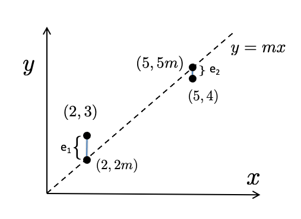

# Optimization

## Introduction

<p> To improve is to make better; to optimize is to make best. Optimization is the act of identifying the extreme (cheapest, tallest, fastest...) over a collection of possibilities. Optimization over __design space__ (also called __decision space__) is a critical feature of many engineering tasks, and has a role in most areas of applied science, including biology. Examples include optimal manipulation of biological systems (e.g. optimal harvesting or optimal drug dosing) or optimal design of biological systems (e.g. robust synthetic genetic circuits). A complementary task is optimal experimental design, which aims to identify the 'best' experiment from a collection of possibilities. Model calibration, to be discussed further below, provides another example; here we seek the 'best fit' version of a model from a collection of possible options.</p>

<p> Optimization is used to investigate natural systems (i.e. in 'pure' science) in cases where nature presents us with an optimal version of a given phenomenon. For example, the principle of energy minimization justifies a wide variety of phenomena, from the shapes of soap bubbles to the configuration of proteins.  Darwinian evolution provides another example. Assuming evolution has arrived at optimal designs, we can apply optimization to understand a variety of biological phenomena, from metabolic flux distribution, to brain wiring, to foraging strategies.</p>

<p> This module introduces optimization methods in R. Although simple optimization tasks, such as those addressed by introductory calculus, can be accomplished with paper-and-pencil calculations, most optimization tasks of interest in biology demand computational techniques.</p>

## Fundamentals of Optimization

Figure 1 illustrates some basics terminology associated with optimization. The graph of a function $f$ of a single variable $x$ is shown, defined over a domain $[a,b]$. In the context of optimization, we can think of each $x$-value in the interval $[a,b]$ as one possible scenario (e.g. enzyme activity, foraging rate, etc.). The function $f$ maps those scenarios to some __objective__ (e.g. metabolic flux, fitness) to be optimized (either maximized or minimized). The _global_ extrema (i.e. maximum and minimum) represent the goals of optimization.

```{r, echo=FALSE, out.height="50%", fig.cap="Figure 1: Extreme Values", fig.alt="A graph showing local maxima and minima"}

```

<!-- <p><center> -->
<!-- `r htmltools::img(src=knitr::image_uri("Figure1.png"))`   -->
<!--   Figure 1: Extreme Values -->
<!-- </center></p> -->

<p> More generally, we define _local_ extrema (maxima and minima) as cases that appear to be optimal if we restrict attention only to 'nearby' possibilities (i.e. $x$-values). Most of the theory of optimization methods is dedicated to identifying local optima. These approaches cannot directly identify a global optimum -- instead they identify _candidate_ global optima, which then can be compared to one another to identify the 'best' result. (A convenient special case occurs for problems where every local optimum is a global optimum; these are called convex optimization problems. Unfortunately, they typically occur only as special cases when addressing biological phenomena.) </p>

### Fermat's Theorem

<p> To illustrate these fundamentals, consider the following two academic examples that rely on basic calculus, specifically on __Fermat's Theorem__, which states that local extrema occur at points where the tangent line to a function's graph is horizontal, i.e. at points where the derivative (the slope of the tangent) is zero (Figure 2). </p>

```{r, echo=FALSE, out.height="50%", fig.cap="Figure 2: Fermat's Theorem: local extrema occur at points where the tangent line is horizontal or at endpoints of the domain. Some local extrema are also global extrema.", fig.alt="A graph showing local maxima and minima at which horizontal tangents occur"}

```

<!-- <p><center> -->
<!-- `r htmltools::img(src=knitr::image_uri("Figure2.png"))`   -->
<!-- Figure 2: Fermat's Theorem: local extrema occur at points where the tangent line is horizontal. Some local extrema are also global extrema. -->
<!-- </center></p> -->

#### Example 1

<p> Task: Identify the value of $x$ for which the function $f(x) = x^2+3x-2$ is minimized. </p>
<p> Solution: Taking the derivative, we find $f'(x) = 2x+3$. To determine the point(s) where the derivative is zero, we solve:
$$f'(x) = 0 \ \ \Leftrightarrow \ \ 2x+3 = 0 \ \ \Leftrightarrow \ \ x = -\frac{3}{2} = -1.5$$
As shown in Figure 3, the single local minimum is the global miminum in this case, so $x=-1.5$ is the desired solution.</p>


```{r, echo=FALSE, out.height="50%", fig.cap="Figure 3: Graph of $f(x) = x^2+3x-2$ (Example 1) ", fig.alt="Graph of $f(x) = x^2+3x-2$"}

```

<!-- <p><center> -->
<!-- `r htmltools::img(src=knitr::image_uri("Figure3.png"))`   -->
<!-- Figure 3: Graph of $f(x) = x^2+3x-2$  (Example 1)    -->
<!-- </center></p> -->

#### Example 2

<p> Task: Identify the value of $x$ for which the function $f(x) = 3x^4-4x^3-54x^2+108x$ is minimized. </p>
<p> Solution: Taking the derivative, we find $f'(x) = 12x^3-12x^2-108x+108 = 12(x-3)(x-1)(x+3)$. To determine the point(s) where the derivative is zero, we solve:

$$f'(x) = 0 \ \ \Leftrightarrow \ \ x = 3, 1, -3$$
As shown in Figure 4, two of these points are local minima and one is a local maximum. Of the two local minima, $x=-3$ is where the global minimum occurs.</p>

```{r, echo=FALSE, out.height="50%", fig.cap="Figure 4: Graph of $f(x) = 3x^4-4x^3-54x^2+108x$  (Example 2) ", fig.alt="Graph of $f(x) = 3x^4-4x^3-54x^2+108x$"}
knitr::include_graphics("Figure4.png")
```

<!-- <p><center> -->
<!-- `r htmltools::img(src=knitr::image_uri("Figure4.png"))`   -->
<!-- Figure 4: Graph of $f(x) = 3x^4-4x^3-54x^2+108x$  (Example 2) -->
<!-- </center></p> -->


## Regression

### Linear Regression

<p> As mentioned above, finding the 'best fit' from a family of models is a common optimization task in science. The simplest example is __linear regression__: the task of determining a line of best fit through a given set of points. </p>
<p> To illustrate, consider the dataset of $(x,y)$ pairs shown in Figure 5 below, which we can label as $(x_1, y_1)$, $(x_2, y_2)$, $\ldots$, $(x_N, y_N)$. Several lines are displayed. The optimization task is to identify the 'best' line: the one that best captures the trend in the data.</p>


```{r, echo=FALSE, out.height="50%", fig.cap="Figure 5: Finding a line of best fit", fig.alt="Points on a plane and potential best fits lines"}

```

<!-- <p><center> -->
<!-- `r htmltools::img(src=knitr::image_uri("Figure5.png"))`   -->
<!-- Figure 5: finding a line of best fit  -->
<!-- </center></p> -->


<p> To specify this task  mathematically, we need to decide on a measure of quality of fit. We start by recognizing that the line will (typically) fail to pass through most of the points in the dataset. Thus, at each point $x_i$ we can define an __error__, which is the difference between the observed $y$-value and the model __prediction__, i.e. the $y$-value on the line. If we specify the line as $y=mx+b$, then the error at $x_i$ can be defined as $e_i = y_i-(mx_i+b)$. We then need to combine these errors into a single quality-of-fit measure. This is typically done by squaring the errors and adding them together. (Squaring ensures that both under- and over-estimations contribute equally.) We define the __sum of squared errors__ (SSE) as :
$$\mbox{SSE:} \ \ \ e_1^2+e_2^2+ \cdots e_N^2 \ \ = \ \ (y_1-(mx_1+b))^2 + (y_2-(mx_2+b))^2 + \cdots +(y_N-(mx_N+b))^2. $$</p>


<p> We can now pose the model-fitting task as an optimization problem. For each line (that is, each assignment of numerical values to $m$ and $b$), we associate a corresponding SSE. We seek the values of $m$ and $b$ for which the SSE is a global minimum. </p>

#### Example 3
<p> Consider a simplified version of linear regression, in which we know that our model (line) should pass through the origin (0,0). That is, instead of lines $y=mx+b$, we will consider only lines of the form $y=mx$. We thus have a single parameter value to determine: the slope $m$. To keep the algebra simple  we'll take a tiny dataset consisting of just two points: $(x_1, y_1) = (2,3)$ and $(x_2, y_2)= (5,4)$, as indicated in Figure 6, below. The line passes through points $(2,2m)$ and $(5, 5m)$. </p>


```{r, echo=FALSE, out.height="50%", fig.cap="Figure 6: Finding a line of best fit through the origin (Example 3)", fig.alt="Defining error between points and line."}

```


<!-- <p><center> -->
<!-- `r htmltools::img(src=knitr::image_uri("Figure6.png"))`   -->
<!-- Figure 6: Example 3: finding a line of best fit through the origin   -->
<!-- </center></p> -->


In this simple case, the sum of squared errors is:
\begin{equation*}
    \mbox{SSE} = \mbox{SSE}(m)= e_1^2+e_2^2 = (3-2m)^2+(4-5m)^2
\end{equation*}
To apply Fermat's theorem we take the derivative and identify any values of $m$ for which the derivative is zero:
\begin{eqnarray*}
    \frac{d}{dm} \mbox{SSE}(m) &=& 2(3-2m)(-2)+2(4-5m)(-5) \\
    &=& -4(3-2m) - 10(4-5m) = -12 +8m+-40+50m = -52+58m.
\end{eqnarray*}
<p> The only local extremum (and hence the only candidate for global minimum) is $m=52/58 = 26/29$. We conclude that the best fit line is $y=\frac{26}{29}x$.</p>

<p> The analysis in Example 3 can be extended to determine the general solution of the linear regression task. For details, see, e.g. (Fairway, 2002). The solution formula is as follows:</p>

<p>
__Linear regression formula__ The best fit line $y=mx+b$ to the dataset $(x_1, y_1)$, $(x_2, y_2)$, $\ldots$, $(x_n, y_n)$ is given by
\begin{eqnarray*}
    m&=& \frac{\sum_{i=1}^n (x_i-\bar{x})(y_i-\bar{y})}{\sum_{i=1}^n (x_i-\bar{x})^2} \\
    b&=& \bar{y}-m\bar{x}, \\
\end{eqnarray*}
where $\bar{x}$ and $\bar{y}$ are the averages
\begin{eqnarray*}
    \bar{x}=\frac{1}{n} \sum_{i=1}^n x_i \ \ \  \ \ \ \ \ \ \ \ \ \  \ \ \
\bar{y}=\frac{1}{n} \sum_{i=1}^n y_i
\end{eqnarray*}  </p>

<p> This formula is somewhat unwieldy, but is straightforward to implement. In R, the command ```lm``` implements this formula, as the following example illustrates. </p>

#### Example 4

We'll work with a dataset called __iris__ that is included in R, shown below (via the `plot` command).


```{r plot-iris-dataset, fig.alt = "Dataset: Sepal Length vs Petal Width", echo = TRUE}
plot(iris$Sepal.Length~iris$Petal.Width, xlab = "Petal Width", ylab = "Sepal Length")
```

The `lm` command applies the formula described above to arrive at the line of best fit (i.e. the minimizer of the sum of squared errors).  The command below generates the parameters ($m$ and $b$) that specify the line $y=mx+b$.

```{r linear_regression_iris_dataset, echo = TRUE}
lm(iris$Sepal.Length~iris$Petal.Width)
```

The best-fit line has intercept $b=4.7776$ and slope is $m=0.8886$.

We can plot the data together with the line of best fit with the `abline` command:
<!-- or __abline(lm(iris$Sepal.Length~iris$Petal.Width))__.  -->


```{r plot-linear_regression_iris_dataset, fig.alt = "Dataset: Sepal Length vs Petal Width, with best-fit line", echo = TRUE}
plot(iris$Sepal.Length~iris$Petal.Width, xlab = "Petal Width", ylab = "Sepal Length")
abline(lm(iris$Sepal.Length~iris$Petal.Width))
```

<!-- Here is a link to a linear regression example where you implement values of X and Y and a plot with those values and a fitted line will be produced.  -->

<!-- https://munkmuni.shinyapps.io/LinearRegression/ -->

### Nonlinear Regression

<p> Nonlinear regression is the task of fitting a nonlinear model (e.g. a curve) to a dataset. The setup for this task is identical to linear regression. We begin by selecting a parameterized family of models (i.e. curves), and aim to identify the model (i.e. curve) that minimizes the sum of squared errors when compared to the data. The choice of model family is typically based on the mechanism that produced the data. For example, if we are investigating  the rate law for a single-substrate enzyme-catalysed reaction, we might choose the family of curves specified by Michaelis-Menten kinetics, which relate reaction velocity $V$ to substrate concentration $S$:
\begin{eqnarray*}
V = \frac{V_{\mbox{max}} S}{K_M+S}
\end{eqnarray*}
Our goal would then be to identify values for the parameters $V_{\mbox{max}}$ and $K_M$ that minimize the sum of squared errors when comparing with observed data. </p>
<p> __Regression via linearizing transformation:__
In several important cases, the nonlinear regression task can be transformed into a linear regression task. In the case of Michaelis-Menten kinetics, several linearizing transformations have been proposed, e.g. Eadie–Hofstee and Lineweaver–Burk (Cho and Lim, 2018). Another common example is fitting exponential curves (to describe e.g. population growth or drug clearance).  In those cases, application of a logarithm transforms the data so that a linear trend is captured. For example, the relationship $y = e^{rt}$ becomes, after applying a logarithm, $Y = \ln(y) = \ln (e^{rt})= rt$. Linear regression on the transformed data $(t_i, Y_i)$ then provides an estimate of the value of $r$.  </p>

<p> Unfortunately, linearizing transformations are only available in a handful of special cases. Moreover, they often introduce biases that can make interpretation of the resulting model difficult.

In general, the nonlinear regression task must be addressed directly. An example of the general procedure in R follows.

#### Example 5

We begin by defining a dataset against which we will fit a Michaelis-Menten curve.

```{r plot-Michaelis-Menten-dataset,  fig.alt = "Dataset: reaction velocity against substrate concentration", echo = TRUE}

#substrate concentrations
S <- c(4.32, 2.16, 1.08, 0.54, 0.27, 0.135, 3.6, 1.8, 0.9, 0.45, 0.225, 0.1125, 2.88, 1.44, 0.72, 0.36, 0.18, 0.9, 0)

#reaction velocities
V <- c(0.48, 0.42, 0.36, 0.26, 0.17, 0.11, 0.44, 0.47, 0.39, 0.29, 0.18, 0.12, 0.50, 0.45, 0.37, 0.28, 0.19, 0.31, 0)
MM_data=cbind(S,V)
plot(MM_data)
```

The ```nls``` command can be used for nonlinear regression in R. Like the ```lm``` command, the ```nls``` function takes as inputs the dataset and the model. In addition, ```nls``` requires that the user provide 'guesses' for the values of the parameters to be estimated. In this case, we can roughly estimate $V_{\mbox{max}} \approx  0.5$ as the maximal $V$-value that can be achieved, and $K_M \approx 0.3$ as the $S$-value at which $V$ reaches half of its maximal value. </p>

```{r nonlinear_regression_Michaelis-Menten_dataset, echo = TRUE}
MMmodel.nls <- nls(V ~ Vmax*S/(Km+S),start = list(Km=0.3, Vmax=0.5)) #perform the nonlinear regression analysis
params <- summary(MMmodel.nls)$coeff[,1] #extract the parameter estimates
params
```

<!-- #summary(MMmodel.nls) #report on the results -->

We thus arrive at parameter estimates that characterize the best-fit model: $K_M = 0.4187090$ and $V_{\mbox{max}} = 0.5331688$). Further details on using the ```nls``` command can be found in (Ritz and Streibig, 2008). We can now plot the best fit model along with the dataset:

```{r plot_nonlinear_regression_Michaelis-Menten_dataset, fig.alt = "Dataset: reaction velocity against substrate concentration and best-fit model",echo = TRUE}
plot(MM_data)
curve((params[2]*x)/(params[1]+x), from = 0, to = 4.5, add=TRUE, col='firebrick')
```

<p> From the implementation of ```nls```, the reader might have the mistaken impression that nonlinear regression and linear regression are very similar tasks.  Although the problem set-up is similar in both cases (chose model type, then minimize SSE), the strategy for optimization is very different. (The first hint of this is the need to provide a set of 'guesses' to ```nls```.) As we saw above, the solution to the linear regression task can be stated as a general formula. For nonlinear regression, no such formula exists. Worse, as we'll discuss in the next section there is no procedure (algorithm) that is guaranteed to find the solution! </p>

## Iterative Optimization Algorithms

<p> The best techniques for addressing the general nonlinear regression task are iterative global optimization routines. As we'll discuss below, these algorithms  start with a 'guess' for the parameter values and then take steps through parameter space to improve the quality of that estimate. In the exercise above, the ```nls``` command executed this kind of algorithm, which is why it requires that the user supply an initial 'guess'. </p>

### Gradient Descent{#gradient}

<p> A simple iterative optimization algorithm is __gradient descent__, which can be understood intuitively via a thought experiment. Imagine finding your way to a valley bottom in a thick fog. The fog obscures your vision so that you can only discern changes in elevation in your immediate vicinity. To make your way to the valley bottom, it would be reasonable to take each step of your journey in the direction of steepest decline. This strategy is guaranteed to lead to a local minimum, but cannot guarantee arrival at the lowest point: the global minimum. That is, the search may lead to a local minimum at which there is no direction of local descent, and so the algorithm gets `stuck'.</p>

<p> Mathematically, the local change in 'elevation' is determined by evaluating the objective function at points near the current estimate  to determine the direction of steepest descent. (Technically, this involves a linearization of the function at the current position, or equivalently a calculation of the _gradient vector_). A step is then taken in this direction, and the process is repeated from this updated estimate. To implement this algorithm, a number of details have to be specified: how long should each step be? How many steps should be taken? Or should there be some other 'termination condition' that will trigger the end of the journey? (Each of these decisions involve a trade-off between precision and computation time. For instance, taking very small steps will guarantee a smooth path down the steepest route, but might take a great many step to complete the journey.) Termination conditions are often specified in terms of the local topography: the algorithm stops when the current estimate is at a sufficiently flat position (no downhill direction detected). </p>

<p>To illustrate the gradient descent approach, consider the following algorithm, which incorporates two termination conditions: a maximum number of allowed iterations and a threshold for shallowness. </p>

```{r gradient-descent,echo=TRUE}
library(numDeriv)       # contains functions for calculating gradient

#define function that implements gradient descent. Inputs are the objective function f, the initial parameter estimate x0,  the size of each step, the maximum number of iterations to be applied, and a threshold gradient below which the landscape is considered flat (at which iterations are terminated)
grad.descent = function(f, x0, step.size=0.05, max.iter=200,
                        stopping.deriv=0.01, ...) {
  n = length(x0)  # record the number of parameters to be estimated (i.e. the dimension of the parameter space)
  xmat = matrix(0,nrow=n,ncol=max.iter) # initialize a matrix to record the sequence of estimates
  xmat[,1] = x0   # the first row of matrix xmat is the initial 'guess'
  for (k in 2:max.iter) { #loop over the allowed number of steps
     # Calculate the gradient (a vector indicating steepness and direct of greatest ascent)
    grad.current = grad(f,xmat[,k-1],...)
    # Check termination condition: has a flat valley bottom been reached?
    if (all(abs(grad.current) < stopping.deriv)) {
      k = k-1; break
    }
    # Step in the opposite direction of the gradient
    xmat[,k] = xmat[,k-1] - step.size * grad.current
  }
  xmat = xmat[,1:k] # Trim any unused columns from xmat
  return(list(x=xmat[,k], xmat=xmat, k=k))
}
```

#### Example 6
 <p>We'll first demonstrating the performance of this algorithm on a simple function with a single local minimum. (Here and below, code for generating plots is suppressed to avoid clutter. All code can be accessed in the .rmd file posted at the associated github repository.) </p>

```{r define-convex-function, echo=TRUE}
Paraboloid = function(x) {
  return((x[1]-3)^2 + 1/3*(x[2])^2+2)
}
```

```{r plot-wireframe-convex-function,fig.alt="Surface plot of paraboloid",echo=FALSE,message=FALSE}
simpleFun = function(x) {
  return((x[1]-3)^2 + 1/3*x[2]^2+2)
}

simpleplotFun = function(x,y) {
  return((x-3)^2 + 1/3*y^2+2)
}
x <- seq(-10, 20, length= 30)
y <- seq(-20, 20, length= 30)
z <- outer(x, y, simpleplotFun)
z[is.na(z)] <- 1
z = as.vector(z)
x <- data.frame(z = as.vector(z))
x$x <- rep(seq(-10, 20, length= 30), 30)
x$y <- rep(seq(-20, 20, length= 30), 30)

require(lattice)
wireframe(z ~ x*y,x, drape=T, expand = 0.5, col = "blue", xlab=NULL, ylab=NULL, zlab=NULL,
          scales = list(arrows = FALSE))

```

 <p>In this case, we expect that the minimum (valley bottom) will be reached from any initial 'guess'. Starting from four distinct points, the algorithm follows the paths shown below. </p>

```{r gradient-descent-convex-function,echo=TRUE}
#define a set of initial guess values
x0 = c(-1.9,-1.9)
x1 = c(-3,1.1)
x2 = c(5,-5)
x3 = c(5,7)

#run the gradient descent algorithm from each
gd = grad.descent(simpleFun,x0,step.size=1/3)
gd1 = grad.descent(simpleFun,x1,step.size=1/3)
gd2 = grad.descent(simpleFun,x2,step.size=1/3)
gd3 = grad.descent(simpleFun,x3,step.size=1/3)

```

```{r gradient-descent-convex-function-plot-paths, fig.alt="Search paths on paraboloid surface", echo=FALSE}

surface = function(f, from.x=0, to.x=1, from.y=0, to.y=1,
                   n.x=30, n.y=30, theta=5, phi=80, ...) {
  # Build the 2d grid
  x.seq = seq(from=from.x,to=to.x,length.out=n.x)
  y.seq = seq(from=from.y,to=to.y,length.out=n.y)
  plot.grid = expand.grid(x.seq,y.seq)
  z.vals = apply(plot.grid,1,f)
  z.mat = matrix(z.vals,nrow=n.x)
  # Plot with the persp function
  orig.mar = par()$mar # Save the original margins
  par(mar=c(1,1,1,1)) # Make the margins small
  r = persp(x.seq,y.seq,z.mat,theta=theta,phi=phi,...)
  par(mar=orig.mar) # Restore the original margins
  invisible(r)
}
```


```{r plot-paths-gradient-descent-convex-function,echo=FALSE}
r = surface(simpleFun,from.x=-5,to.x=10,from.y=-10,to.y=10,xlab="",ylab="",zlab="")
points(trans3d(x0[1],x0[2],simpleFun(x0),r),col="red",cex=2)
points(trans3d(gd$xmat[1,],gd$xmat[2,],apply(gd$xmat,2,simpleFun),r),
      col="blue")
lines(trans3d(gd$xmat[1,],gd$xmat[2,],apply(gd$xmat,2,simpleFun),r),
      lwd=2,col="green")
points(points(trans3d(gd$x[1],gd$x[2],simpleFun(gd$x),r),
              col="black",cex=2))

points(trans3d(x1[1],x1[2],simpleFun(x1),r),col="red",cex=2)
points(trans3d(gd1$xmat[1,],gd1$xmat[2,],apply(gd1$xmat,2,simpleFun),r),
      col="blue")
lines(trans3d(gd1$xmat[1,],gd1$xmat[2,],apply(gd1$xmat,2,simpleFun),r),
      lwd=2,col="orange")
points(points(trans3d(gd1$x[1],gd1$x[2],simpleFun(gd1$x),r),
              col="black",cex=2))

points(trans3d(x2[1],x2[2],simpleFun(x2),r),col="red",cex=2)
points(trans3d(gd2$xmat[1,],gd2$xmat[2,],apply(gd2$xmat,2,simpleFun),r),
      col="blue")
lines(trans3d(gd2$xmat[1,],gd2$xmat[2,],apply(gd2$xmat,2,simpleFun),r),
      lwd=2,col="firebrick")
points(points(trans3d(gd2$x[1],gd2$x[2],simpleFun(gd2$x),r),
              col="black",cex=2))

points(trans3d(x3[1],x3[2],simpleFun(x3),r),col="red",cex=2)
points(trans3d(gd3$xmat[1,],gd3$xmat[2,],apply(gd3$xmat,2,simpleFun),r),
      col="blue")
lines(trans3d(gd3$xmat[1,],gd3$xmat[2,],apply(gd3$xmat,2,simpleFun),r),
      lwd=2,col="magenta")
points(points(trans3d(gd3$x[1],gd3$x[2],simpleFun(gd3$x),r),
              col="black",cex=2))
```


<p> The table below shows the estimates and the corresponding objective values reached by gradient descent starting from those four points. Each run has arrived at essentially the same point: $(3, 0)$, where the function reaches its mimimum value of 2. </p>

```{r final-output-plot-paths-gradient-descent-convex-function,echo=FALSE}
x0_out <- c(gd$x, simpleFun(gd$x))
x1_out <- c(gd1$x, simpleFun(gd1$x))
x2_out <- c(gd2$x, simpleFun(gd2$x))
x3_out <- c(gd3$x, simpleFun(gd3$x))
output <- rbind(x0_out,x1_out,x2_out,x3_out)
colnames(output) <- c("x1","x2","objective value")
output
```


#### Example 7

 <p>Next, let's consider a  function that has multiple local minima. The second plot below is interactive, allowing you to rotate the surface.</p>

```{r complicated-function, echo=TRUE}
Example_7_function = function(x) {
  return((1/2*x[1]^2+1/4*x[2]^2+3)+cos(2*x[1]+1-exp(x[2])))
}
```

```{r plot-wireframe-complicated-function, fig.alt="Surface plot with multiple minima", echo=FALSE,message=FALSE}
Example_7_function_plotting = function(x,y) {
  return((1/2*x^2+1/4*y^2+3)+cos(2*x+1-exp(y)))
}

x <- seq(-4, 4, length= 30)
y <- seq(-4, 4, length= 30)
z <- outer(x, y, Example_7_function_plotting)
z[is.na(z)] <- 1
z = as.vector(z)
x <- data.frame(z = as.vector(z))
x$x <- rep(seq(-4, 4, length= 30), 30)
x$y <- rep(seq(-4, 4, length= 30), 30)

require(lattice)
wireframe(z ~ x*y,x, drape=T, expand = 0.5, col = "blue", xlab=NULL, ylab=NULL, zlab=NULL,
          scales = list(arrows = FALSE))
```


```{r plot-surface-complicated-function,fig.alt="Interactive surface plot with multiple minima", echo=FALSE,message=FALSE,warning=FALSE}
library(MASS)
library(plotly)
x <- seq(-4, 4, length= 30)
y <- seq(-4, 4, length= 30)
z <- outer(x, y, Example_7_function_plotting)
z[is.na(z)] <- 1
fig <- plot_ly(x = x, y = y, z = z,color = "blue") %>% add_surface()

fig
```

<p> Again, we'll apply gradient descent from a set of initial guess positions: </p>

```{r gradient-descent-and-plot-paths-complicated-function,echo=TRUE}
#define a set of initial guess values
x0 = c(0.5,0.5)
x1 = c(-0.1,-1.3)
x2 = c(-1.5,1.3)
x3 = c(-1.2,-1.4)
x4 = c(-0.5,-0.5)
#run the gradient descent algorithm from each
gd0 = grad.descent(Example_7_function,x0,step.size=0.01,max.iter=1000)
gd1 = grad.descent(Example_7_function,x1,step.size=0.01,max.iter=1000)
gd2 = grad.descent(Example_7_function,x2,step.size=0.01,max.iter=1000)
gd3 = grad.descent(Example_7_function,x3,step.size=0.01,max.iter=1000)
gd4 = grad.descent(Example_7_function,x4,step.size=0.01,max.iter=1000)
```

<p>  From some initial guess values, the algorithm successfully reaches the global minimum. From others, it gets stuck at a local minimum. The plot below shows the paths followed by the algorithm, leading to two separate valley bottoms. </p>

```{r gradient-descent-plot-paths-complicated-function, fig.alt="Surface plot with multiple minima and search paths", echo=FALSE}

r = surface(Example_7_function,from.x=-2,to.x=2,from.y=-2,to.y=2,
xlab="",ylab="",zlab="")
lines(trans3d(gd0$xmat[1,],gd0$xmat[2,],apply(gd0$xmat,2,Example_7_function),r),
      lwd=2,col="red")
points(trans3d(gd0$xmat[1,],gd0$xmat[2,],apply(gd0$xmat,2,Example_7_function),r),
      col="red")
points(trans3d(gd4$xmat[1,],gd4$xmat[2,],apply(gd4$xmat,2,Example_7_function),r),
      col="blue")
lines(trans3d(gd4$xmat[1,],gd4$xmat[2,],apply(gd4$xmat,2,Example_7_function),r),
      lwd=2,col="blue")
lines(trans3d(gd2$xmat[1,],gd2$xmat[2,],apply(gd2$xmat,2,Example_7_function),r),
      lwd=2,col="purple")
points(trans3d(gd2$xmat[1,],gd2$xmat[2,],apply(gd2$xmat,2,Example_7_function),r),
      col="purple")
lines(trans3d(gd3$xmat[1,],gd3$xmat[2,],apply(gd3$xmat,2,Example_7_function),r),
      lwd=2,col="darkgreen")
points(trans3d(gd3$xmat[1,],gd3$xmat[2,],apply(gd3$xmat,2,Example_7_function),r),
      col="darkgreen")
lines(trans3d(gd1$xmat[1,],gd1$xmat[2,],apply(gd1$xmat,2,Example_7_function),r),
      lwd=2,col="orange")
points(trans3d(gd1$xmat[1,],gd1$xmat[2,],apply(gd1$xmat,2,Example_7_function),r),
      col="orange")
```

<p>  The table below shows the final estimate and the corresponding objective value reached by gradient descent starting from those five starting points. </p>

```{r final-output-plot-paths-gradient-descent-complicated-function,echo=FALSE}
x0_out <- c(gd0$x, Example_7_function(gd0$x))
x1_out <- c(gd1$x, Example_7_function(gd1$x))
x2_out <- c(gd2$x, Example_7_function(gd2$x))
x3_out <- c(gd3$x, Example_7_function(gd3$x))
x4_out <- c(gd4$x, Example_7_function(gd4$x))
output <- rbind(x0_out,x1_out,x2_out,x3_out,x4_out)
colnames(output) <- c("x1","x2","objective value")
output
```


#### Exercise 1

Consider the following dataset, which corresponds to measurements of drug concentration in the blood over time. try fitting the data to an exponential $C(t) = a e^{-r t}$. You'll find that the best-fit model is not satisfactory. Next, try fitting a biexponential $C(t) = a_1 e^{-r_1 t} + a_2 e^{-r_2 t}$. You'll find a more suitable agreement. For fitting, you can either use the ```nls``` command or the gradient descent function above (along with a sum of squared errors function). For ```nls```, you may find the algorithm is very sensitive to your choice of initial guess (and will fail if the initial guess is not fairly accurate).  For gradient descent, you'll need to use a small stepsize, e.g. $10^{-5}$, and a large number of iterations.


```{r exercise-1-dataset2, fig.alt="Drug concentration data for exercise 1", echo = TRUE}

t <- c(0, 10, 20, 30, 40, 50, 60, 70, 80, 90, 100)
C <- c(5.5850, 4.392, 3.2564, 2.9971, 2.6493, 2.3863, 2.0838, 2.0862, 1.7009, 1.7339, 1.4162)
BE_data=cbind(t,C)
plot(BE_data)
```

 <!--SOLUTION #true values: 3,3, 0.1, 0.01-->
<!-- ```{r exercise-1-grad-descent-soln, echo = TRUE} -->
<!-- #define SSE -->
<!-- determine_sse <- function(x){ -->
<!--   pred<-(x[1]*exp(-x[2]*T)+x[3]*exp(-x[4]*T)) -->
<!--   obs<-C -->
<!--   sse<-sum((obs - pred)^2) -->
<!--   return(sse) -->
<!-- } -->
<!-- x0 = c(2,0.1,4,0.01) -->
<!-- gd = grad.descent(determine_sse,x0,step.size=0.00001,max.iter=20000,  -->
<!--                         stopping.deriv=0.01) -->
<!-- x0_out <- c(gd$x, simpleFun(gd$x)) -->
<!-- x0_out -->
<!-- plot(BE_data) -->
<!-- curve(x0_out[1]*exp(-x0_out[2]*x)+x0_out[3]*exp(-x0_out[4]*x), from = 0, to = 100, add=TRUE, col='firebrick') -->
<!-- ``` -->

<!-- ```{r exercise-1-grad-descent-part-2-soln, echo = TRUE} -->
<!-- #define SSE -->
<!-- determine_sse <- function(x){ -->
<!--   pred<-(x[1]*exp(-x[2]*T)) -->
<!--   obs<-C -->
<!--   sse<-sum((obs - pred)^2) -->
<!--   return(sse) -->
<!-- } -->
<!-- x0 = c(3,0.01) -->
<!-- gd = grad.descent(determine_sse,x0,step.size=0.00001,max.iter=20000,  -->
<!--                         stopping.deriv=0.01) -->
<!-- x0_out <- c(gd$x, simpleFun(gd$x)) -->
<!-- x0_out -->
<!-- plot(BE_data) -->
<!-- curve(x0_out[1]*exp(-x0_out[2]*x), from = 0, to = 100, add=TRUE, col='firebrick') -->
<!-- ``` -->


<!-- ```{r exercise_1_nls_soln, echo = FALSE} -->
<!-- BEmodel.nls <- nls(C ~ a_1*exp(r_1*T) + a_2*exp(r_2*T),start = list(a_1 = 3, a_2=3, r_1 = 0.01, r_2=0.1)) -->
<!-- summary(BEmodel.nls) -->

<!-- params <- summary(BEmodel.nls)$coeff[,1] #extracting the parameter estimates -->
<!-- plot(BE_data) -->
<!-- curve(params[1]*exp(params[3]*x) + params[2]*exp(params[4]*x), from = 0, to = 100, add=TRUE, col='firebrick') -->
<!-- ``` -->

<!-- ```{r exercise_1_part_2_nls_soln, echo = FALSE} -->
<!-- BEmodel.nls <- nls(C ~ a*exp(r*T),start = list(a = 3,  r = 0.01)) -->
<!-- summary(BEmodel.nls) -->

<!-- params <- summary(BEmodel.nls)$coeff[,1] #extracting the parameter estimates -->
<!-- plot(BE_data) -->
<!-- curve(params[1]*exp(params[2]*x), from = 0, to = 100, add=TRUE, col='firebrick') -->
<!-- ``` -->


### Global Optimization

<p> The default optimization algorithm used by ```nls``` is the Gauss-Newton method, which is a generalization of Newton's method. (You may recall using Newton's method to solve nonlinear equations in an introductory calculus course.) Gauss-Newton is a refinement of gradient descent in which the local curvature of the function is used to predict the position of the bottom of the local valley.  </p>

<p> Both gradient descent and the Gauss-Newton method are designed to reach the bottom of the valley in which the initial guess lies. If that's  not the global minimum, then the algorithm will not be successful.  So, how does one select a 'good' initial guess? Unfortunately, there's no general answer to this question. In some cases, one can use previous knowledge of the system to identify a solid initial guess. If no such previous knowledge is available, sometimes a 'wild guess' is all we have. In those cases, we may have little confidence that the algorithm will arrive at a global minimum. The simplest way to improve the chance of achieving a global minimum is the __multi-start__ strategy: choose many initial guesses, and run the algorithm from each (as in Example 7 above). This can be computationally expensive, but if the initial guesses are spread widely over the parameters space, one can expect that the global minimum will be achieved. </p>

<p> A number of methods have been developed to complement the multi-start approach. These are known as __global optimization routines__. They are also known as _heuristic_ methods, because their performance cannot be guaranteed in general: there are no guarantees that they'll find the global minimum, nor are there solid estimates of how many iterations will be required for them to carry out a satisfactory search of the parameter space. We will consider two commonly used heuristic methods: simulated annealing and genetic algorithms. </p>

#### Simulated Annealing

<p> __Simulated annealing__ is motivated by the process of annealing, which is a heat treatment by which the physical properties of metals can be altered. Simulated annealing is an iterative algorithm; the algorithm starts at an initial guess, and then steps through the search space. In contrast to gradient descent, the steps taken in simulated annealing are partially random. Consequently, the path followed from a particular initial condition won't be repeated if the algorithm is run again from the same point. (Algorithms that incorporate randomness are often referred to as _Monte Carlo_ methods, in reference to the European gambling centre.)  At each step, the algorithm begins by identifying a candidate next position. (This point could be selected by a variant of gradient descent, or some other method).  The value of the objective at this candidate point is then compared with the objective value at the current point. If the objective is lower at the candidate point (i.e. this step takes the algorithm downhill), then the step is taken and a new iteration begins. If the value of the objective is larger at the candidate point (i.e. the step makes things _worse_), the step can still be taken, but only with a small probability. Both the size of the steps and the probability of accepting 'wrong' (uphill) steps are tied to a __cooling schedule__: a decreasing 'temperature' profile. At high temperatures, large steps are considered and 'wrong' steps are taken frequently; as the temperature drops, only smaller steps are considered, and fewer 'wrong' steps are allowed. By analogy, imagine a ping-pong ball resting on a curved landscape. One strategy to move the ball to the lowest valley bottom is to shake the table. To following a strategy inspired by simulated annealing, we could begin by applying violent shakes (high temperature) which would result in the ball bouncing across much of the landscape. By slowly reducing the severity of the shaking, we could ensure the ball would settle into a local minimum at a valley bottom. The hope is that if the cooling schedule is well-chosen, the ball would have sampled many valleys, and would end up at the bottom of the lowest valley. Simulated annealing can be combined with a multi-start strategy to further ensure broad sampling of the search space. </p>

#### Example 8

<p> To illustrate, we'll apply simulated annealing to the optimization task in Example 7 above, using the same initial guess points. We'll use the ```GenSA``` library to implement the algorithm (described in detail [here](https://cran.r-project.org/web/packages/GenSA/GenSA.pdf)). Calls to ```GenSA``` require that we specify (i) the objective function; (ii) an initial guess; and (iii) upper and lower bounds for the search values for each parameter. (Optional input parameters allow the user to modify internal features of the algorithm such as the cooling schedule and stepping protocol.) To begin, we apply the algorithm at the first initial guess:

```{r simulated-annealing-complicated-function,echo=TRUE}
library(GenSA)

out0 <- GenSA(par = x0, lower = c(-2,-2), upper = c(2,2),fn = Example_7_function)
out0[c("value","par")]
```
<p> The result of this function call is recorded in the variable ```out0``` which indicates the minimal value of the objective achieved (2.426731) and the parameter values at which this minimum occurs $(x,y)= (-0.3629442,  1.1734789)$ (matching the solution founds above). Next, we'll call ```GenSA``` starting from each of the initial guesses that were provided to the gradient descent algorithm in Example 7. </p>

```{r seed_setex8, echo=FALSE}
set.seed(1234) # The user can use any seed.
```

```{r multi-start-simulated-annealing-complicated-function,message=TRUE}
library(GenSA)

dimension <- 2
global.min <- 0
tol <- 1e-13
lower <- rep(-2, dimension)
upper <- rep(2, dimension)

out0 <- GenSA(par = x0, lower = lower, upper = upper,fn = Example_7_function)
out1 <- GenSA(par = x1, lower = lower, upper = upper,fn = Example_7_function)
out2 <- GenSA(par = x2, lower = lower, upper = upper,fn = Example_7_function)
out3 <- GenSA(par = x3, lower = lower, upper = upper,fn = Example_7_function)
out4 <- GenSA(par = x4, lower = lower, upper = upper,fn = Example_7_function)
out0[c("value","par")]
out1[c("value","par")]
out2[c("value","par")]
out3[c("value","par")]
out4[c("value","par")]
```

<p> We see that in each case, simulated annealing has avoided getting 'stuck' in the local minima. It has achieved the same optimized value from every initial guess. </p>

<p> The plot below provides some insight into how the simulated annealing runs proceed. Iterations (steps) are shown along the horizontal axis. The vertical axis shows values of the objective function. The blue points represents the function value at the current position, while the red shows the minimum achieved so far. The minimum is found rather quickly, but the algorithm continues to explore the search space.</p>

```{r output-simulated-annealing-complicated-function, echo-TRUE}
plot(out1$trace.mat[,4][1:8000],type="l",lwd=4,col="red",xlab="Iteration number",ylab="Objective value")
points(out1$trace.mat[,3][1:8000],pch=20,col="blue")
```

#### Example 9
<p> To give the simulated annealing algorithm a more challenging task, consider the following function, which has many local minima. (Near the origin, the graph resembles an egg carton).
$$f(x,y) = (y+47)\sin\left (\sqrt{|y+(x/2)+47|)}-x\sin(\sqrt{|x-(y+47)|} + \frac{1}{1000}\left(x^2+y^2\right)\right)$$
</p>

```{r define-egg-carton-function, ECHO=TRUE}
f.egg<- function(x){
  -(x[,2]+47)*sin(sqrt(abs(x[,2]+(x[,1]/2)+47)))-x[,1]*sin(sqrt(abs(x[,1]-(x[,2]+47))))+ 0.001*x[,1]^2 + 0.001*x[,2]^2
}
```

```{r plot-wireframe-egg-carton-function, fig.alt="Surface plot with many minima, resembling an egg carton", echo=FALSE}
f.name <- "Example 9"

# make the function
f.egg<- function(x){
  -(x[,2]+47)*sin(sqrt(abs(x[,2]+(x[,1]/2)+47)))-x[,1]*sin(sqrt(abs(x[,1]-(x[,2]+47))))+ 0.001*x[,1]^2 + 0.001*x[,2]^2
}

# define the function
f.egghold <- function(x) {
  # make x a matrix so this function works for plotting and for optimizing
  x <- matrix(x, ncol=2)
  # calculate the function value for each row of x
  f.x <- f.egg(x)
  # return function value
  return(f.x)
}

# plot the function
# define ranges of x to plot over and put into matrix
x1 <- seq(-512, 512, length = 101)
x2 <- seq(-512, 512, length = 101)
X <- as.matrix(expand.grid(x1, x2))
colnames(X) <- c("x1", "x2")

# evaluate function
y <- f.egghold(X)

# put X and y values in a data.frame for plotting
df <- data.frame(X, y)
# plot the function
library(lattice) # use the lattice package
wireframe(y ~ x1 * x2 # y, x1, and x2 axes to plot
  , data = df # data.frame with values to plot
  , main = f.name # name the plot
  , shade = TRUE
  , scales = list(arrows = FALSE) # include axis ticks
  , screen = list(z = -100, x = -30) # view position
)
```

```{r define-egg-carton-function-again,echo=FALSE}

f.egg<- function(x){
  -(x[2]+47)*sin(sqrt(abs(x[2]+(x[1]/2)+47)))-x[1]*sin(sqrt(abs(x[1]-(x[2]+47))))+ 0.001*x[1]^2 + 0.001*x[2]^2
}

```

We will use simulated annealing to search for the minimum value. We'll start the algorithm from two different initial guesses. Both runs result in the same solution:

```{r egg-carton-simulated-annealing-runs, echo=TRUE}
#define a set of initial guess values

#initial guesses
x1 <- c(100,100)
x2 <- c(0,100)

#specify bounds
lower <- rep(-200, 2)
upper <- rep(200, 2)


egg.out1 <- GenSA(par = x1, lower = lower, upper = upper,fn = f.egg)
egg.out2 <- GenSA(par = x2, lower = lower, upper = upper,fn = f.egg)
egg.out1[c("value","par")]
egg.out2[c("value","par")]
```

From the plots below we see that the algorithm occasionally gets stuck at local minima, but in both cases has visited the lowest point.

```{r plot-egg-carton-simulated-annealing-traces,fig.alt="Progress of simulated annealing algorithm", echo=FALSE}
plot(egg.out1$trace.mat[,4],type="l",lwd=4,col="red")
points(egg.out1$trace.mat[,3],pch=20,col="blue")

plot(egg.out2$trace.mat[,4],type="l",lwd=4,col="red")
points(egg.out2$trace.mat[,3],pch=20,col="blue")
```

We next consider a heuristic algorithm in which multiple paths through the search space are followed simultaneously.

#### Genetic Algorithms

<p> __Genetic algorithms__ are inspired by Darwinian evolution. The algorithm begins with the specification of a population of initial guesses. At each iteration of the algorithm, this population 'evolves' toward improved estimates of the global minimum. This 'evolution' step involves three substeps: selection, mutation, and cross-over. In the selection step, the population is pruned by removing a fraction that are not sufficiently fit. (Here fitness corresponds to the value of the objective function being minimized.) Then, mutations are introduced into the remaining population by adding small random perturbations to their position in the search space. Finally, a new generation is produced by crossing members of the current population. This can be done in several ways; the simplest is to generate crosses as averages of the numerical values of the two 'parents'. Through several generations, this process leads to a population with high fitness (minimal objective) after a thorough exploration of the search space. Genetic algorithms are a subset of the more general class of _evolutionary algorithms_ all of which involve simultaneous exploration of the search space through multiple paths.  </p>

#### Example 10

</p>To implement a genetic algorithm, we'll make use of the ```ga``` function, from ```Library(GA)```, described [here](https://cran.r-project.org/web/packages/GA/GA.pdf). The call to ```ga``` requires that we specify the objective function, lower and upper bounds to define the search space, and the number of iterations to execute. The initial population is generated automatically. The ```ga``` routine maximizes the objective function, so we enter our objective with a negative sign to achieve minimization. We consdier again the function from Example 7. </p>

```{r call-GA, echo=TRUE}
Example_7_fun = function(x,y) {
  return((1/2*x^2+1/4*y^2+3)+cos(2*x+1-exp(y)))
}

library(GA)
ga <- ga(type = "real-valued", fitness = function(x) -Example_7_fun(x[1],x[2]),
         lower = c(-2, -2), upper = c(2, 2), maxiter = 30)
```

Plotting the results of the genetic algorithm search, we see improvement in the overall behaviour from generation to generation.

```{r plot-GA-output, echo=TRUE}
plot(ga)
```

The summary displayed below shows that the solutions reached by the genetic algorithm agrees with the solution found by simulated annealing.

```{r report-summary-GA, fig.alt="Progress of genetic algorithm",echo=TRUE}
summary(ga)
```

#### Exercise 2
Apply the genetic algorithm with ```ga``` to confirm the minimum of the egg-carton function in Example 9.


<!-- SOLUTION -->

<!-- Here is the code for the egg-carton function: -->
<!-- ```{r ex2-define egg-carton, echo = TRUE} -->
<!-- f.egg<- function(x,y){ -->
<!--   -(y+47)*sin(sqrt(abs(y+(x/2)+47)))-x*sin(sqrt(abs(x-(y+47))))+ 0.001*x^2 + 0.001*y^2 -->
<!-- } -->
<!-- ``` -->

<!-- Here is the code for the genetic algorithm: -->
<!-- ```{r ex2-call-GA-egg-carton, echo = TRUE} -->
<!-- ga1 <- ga(type = "real-valued", fitness = function(x) -f.egg(x[1],x[2]), -->
<!--          lower = c(-200, -200), upper = c(200, 200), maxiter = 30) -->
<!-- ``` -->

<!-- Now try plotting the results of the genetic algorithm search as well as getting a summary of the results to confirm that the fitness function value obtained through this method is the same as the value obtained through simulated annealing.  -->

<!-- ```{r ex2-results, echo = TRUE} -->
<!-- plot(ga1) -->
<!-- summary(ga1) -->
<!-- ``` -->

## Calibration of Dynamic Models

<p> The principles of nonlinear regression carry over directly to calibration of more complex models. In many domains of biology, dynamic models are used to describe the time-varying behaviour of systems (from, e.g., biomolecular networks to physiology to ecology). Dynamic models take many forms; a commonly used formulation is based on ordinary differential equations (i.e. _rate equations_). These models are deterministic (i.e., they do not incorporate random effects) and assume that the dynamics occur in a spatially homogeneous (well-mixed) environment. Despite these limitations, these models can describe a wide variety of dynamic behaviours, and are useful for investigations across a range of biological domains. </p>

<p> Differential equation models used in biology often take the form
\begin{equation*}
    \frac{d}{dt} {\bf x}(t) = {\bf f}({\bf x}(t), {\bf p})
\end{equation*}
where components of the time-varying vector ${\bf x}(t)$ are the _states_ of the system (e.g. population sizes, molecular concentrations), the components of vector ${\bf p}$ are the _model parameters_: numerical values that represent fixed features of the system and its environment (e.g. interaction strengths, temperature, nutrient availability), and the vector-valued function ${\bf f}$ describes the rate of change of the state variables. As a concrete example, consider the Lotka-Volterra equations, a classical model describing interacting predator and prey populations:
\begin{eqnarray*}
    \frac{d}{dt} x_1(t) &=& \alpha x_1(t) - \beta x_1(t) x_2(t)\\
    \frac{d}{dt} x_2(t) &=& \gamma x_1(t) x_2(t) - \delta x_2(t)\\
\end{eqnarray*} </p>
Here $x_1$ is the size of the prey population; $x_2$ is the size of the predator population. The prey are presumed to have access to resources that support exponential growth in the absence of predation: growth at rate $\alpha x_1(t)$. Interactions between prey and predators, assumed to occur at rate $x_1(t) x_2(t)$, lead to decrease of the prey population and increase of the predator population (characterized by parameters $\beta$ and $\gamma$ respectively). Finally, the prey suffer an exponential decline in population size in the absence of prey: decay at rate $\delta x_2(t)$. A simulation of the model, shown below, demonstrates the a boom-bust cycle of oscillations in both populations. Simulation of the model requires specification of numerical values for each of the four model parameters, $\alpha$, $\beta$, $\gamma$, $\delta$, and the two initial population sizes $x_1(0)$ and $x_2(0)$. We generate the simulation by a call to the ```ode``` function from the deSolve library described [here](https://cran.r-project.org/web/packages/deSolve/vignettes/deSolve.pdf).
</p>


```{r simulate-and-plot-lotka-volterra, fig.alt="Simulation of Lotka-Volterra system", echo = TRUE, warning = FALSE}
library(deSolve)

# define the dynamic model
LotVmod <- function (Time, State, Pars) {
    with(as.list(c(State, Pars)), {
        dx1 = alpha*x1 - beta*x1*x2
        dx2 = delta*x1*x2- gamma*x2
        return(list(c(dx1, dx2)))
    })
}

#specify the model parameters, the initial populations, and the time course
Pars <- c(alpha = 30, beta = 5, gamma = 2, delta = 6)
State <- c(x1 = 8.792889e-3, x2 = 1.595545)
Time <- seq(0, 6, by = 0.01)

#simulate the model
out <- as.data.frame(ode(func = LotVmod, y = State, parms = Pars, times = Time))

#plot the output
plot(out$x2~out$time, type = "l", xlab = "Time", ylab = "Population Density", main = "Predatory-Prey Model Simulation", col = "red", ylim = c(0,20))
points(out$x1~out$time, type = "l", add = TRUE)
legend(3.8,20,legend = c("Prey", "Predator"), col = c("red", "black"), pch = 20)
```

<p> The dataset shown below corresponds to observations of an oscillatory predator-prey  system. To calibrate the Lotka-Volterra model to this data we seek values of the  model parameters  for which simulation of the model provides the best fit. As in the regression tasks described previously, the standard measure for quality of fit is the sum of squared errors. We thus proceed with a minimization task: for each choice of numerical values for the model parameters, we compare model simulation with the data and determine the sum of squared errors. We aim to minimize this measure of fit over the space of model parameters. </p>


```{r define_observations_corrupted, generated in subsequent block as x_obs_corrupt, y_obs_corrupt}

x1_obs_data= c(8.792889e-3, 9.57e-01, 1.01e-01, 4.12e-05, 1.68e-06, 1.40e-06, 9.40e-06, 2.62e-04, 1.46e-02, 1.51, 2.31e-02, 2.38e-05, 1.48e-06, 1.76e-06, 1.39e-05, 4.25e-04, 2.96e-02, 3.00, 6.87e-03, 1.16e-05, 1.27e-06, 2.31e-06, 2.01e-05, 7.69e-04, 5.31e-02, 4.38e+00, 2.08e-03, 7.06e-06, 1.24e-06, 2.83e-06, 3.16e-05)
x2_obs_data=c(1.595545, 1.60, 20.79,  9.60,  5.99,  3.61,  2.71,  2.44,  1.08,  1.10, 14.68, 12.53,  6.55,  4.40,  2.73,  2.05,  1.40,  2.20, 16.36,  7.66, 5.56,  5.26,  2.28,  2.27,  1.14,  3.27, 14.13,  7.69,  6.10,  4.68, 2.40)
```


```{r generate-and-plot-lotka-volterra-corrupted-data, fig.alt="Data for Lotka-Volterra system", echo = FALSE, warning = FALSE}
observations<-data.frame(t_obs<-out$time[seq(1,length(out$time),20)],
                  x1_obs<-out$x1[seq(1,length(out$x1),20)],
                  x2_obs<-out$x2[seq(1,length(out$x2),20)])
# set random seed for noise to be added
set.seed(12)
#generate one random number in [0,1] for each observation
unscaled_noise<-runif(length(t_obs))


#generate corrupted observations
corrupted_observations<-data.frame(t_obs,
                  x1_obs_corrupt<- x1_obs+ ((unscaled_noise*2-1)*(0.1*x1_obs)),
                  x2_obs_corrupt<- x2_obs+ ((unscaled_noise*2-1)*(0.3*x2_obs)) )

#plot corrupted observation vector (scatterplot is needed...)
corplot<-plot(corrupted_observations[,3]~corrupted_observations[,1], col = "red", ylim = c(0,20), main = "Observations of a Predator-Prey Population System", xlab = "Time", ylab = "Population Density", pch = 20)
points(corrupted_observations[,2]~corrupted_observations[,1], add = TRUE, pch = 20)
legend(4,20, legend = c("Prey", "Predator"), col = c("red", "black"), pch = 20)
not_used<-corplot
```

#### Example 11

To illustrate, we'll consider the case that two of the model parameter values have been established independently: $\alpha= 30$ and $\delta=6$. We'll then calibrate the model by estimating values for parameters $\beta$ and $\gamma$. We begin by building a sum-of-squared errors function that takes values of $\beta$ and $\gamma$ as arguments. We will use the observed population values at time zero as initial condition for the simulations.

```{r define-lotka-volterra-sse-function, echo = TRUE}
#define SSE function
library(deSolve)
determine_sse <- function(p) {

  #inputs are the two unknown model parameters collected into a vector p=[beta, gamma]
  newPars <- c(p[1],p[2])
  #initial populations are the observed values at time zero for x and y, respectively
  newState <- c(x1 = 8.792889e-3, x2 = 1.595545)

  #define the time-grid (same as above)
  Time <- seq(0, 6, by = 0.01)
  t_obs<-c(0.0, 0.2, 0.4, 0.6, 0.8, 1.0, 1.2, 1.4, 1.6, 1.8, 2.0, 2.2, 2.4, 2.6, 2.8, 3.0, 3.2, 3.4, 3.6, 3.8, 4.0, 4.2, 4.4, 4.6, 4.8, 5.0, 5.2, 5.4, 5.6, 5.8, 6.0)

  #dynamics as before
newLotVmod <- function (Time, State, newPars) {
    with(as.list(c(State, newPars)), {
        dx1 = x1*(30 - p[1]*x2)
        dx2 = -x2*(p[2] - 6*x1)
        return(list(c(dx1, dx2)))
    })
}

  #run the simulation with the user-specified values for beta and gamma
  new_out <- as.data.frame(ode(func = newLotVmod, y = newState, parms = newPars, times = Time))

  #generate vector of predictions to align with vector of observations
  x1_pred<-new_out$x1[seq(1,length(new_out$x1),20)]
  x2_pred<-new_out$x2[seq(1,length(new_out$x2),20)]

  sse<-sum((x1_obs_data - x1_pred)^2) + sum((x2_obs_data - x2_pred)^2)
  return(sse)
}

```

We now call an optimization routine to search the space of $\beta$ and $\gamma$ values to minimize this SSE function. We apply the simulated annealing function ```GenSA``` as described above, with initial guess of $\beta=1$, $\gamma=1$:

```{r set-SA-seed, echo=FALSE}
# set random seed for noise to be added
set.seed(12)
```

```{r SA-call-lotka-volterra, echo = TRUE, warning = FALSE}
library(GenSA)
p1 = c(1,1)
lower <- c(0.1,0.1)
upper <- c(10,10)
out0 <- GenSA(par = p1, lower = lower, upper = upper,fn = determine_sse, control = list(maxit = 4))
out0[c("value","par")]
```

The search algorithm has identified values of $\beta=4.915$ and $\gamma=2.018$ as minimizer, with the minimal sum of squares error value of 45.58991.

The best fit model simulation is shown along with the data below:

```{r plot-lotka-volterra-best-fit-and-data, fig.alt="Data for Lotka-Volterra system and best-fit simulation",echo = FALSE, warning = FALSE}

library(deSolve)

LotVmod <- function (Time, State, Pars) {
    with(as.list(c(State, Pars)), {
        dx1 = x1*(alpha - beta*x2)
        dx2 = -x2*(gamma - delta*x1)
        return(list(c(dx1, dx2)))
    })
}

Pars <- c(alpha = 30, beta = 4.914941, gamma = 2.018206, delta = 6)
State <- c(x1 = 8.792889e-3, x2 = 1.595545)
Time <- seq(0, 6, by = 0.01)

out <- as.data.frame(ode(func = LotVmod, y = State, parms = Pars, times = Time))


observations<-data.frame(t_obs<-out$time[seq(1,length(out$time),20)],
                  x1_obs<-out$x1[seq(1,length(out$x1),20)],
                  x2_obs<-out$x2[seq(1,length(out$x2),20)])
# set random seed for noise to be added
set.seed(12)
#generate one random number in [0,1] for each observation
unscaled_noise<-runif(length(t_obs))


#generate corrupted observations
corrupted_observations<-data.frame(t_obs,
                  x1_obs_corrupt<- x1_obs+ ((unscaled_noise*2-1)*(0.1*x1_obs)),
                  x2_obs_corrupt<- x2_obs+ ((unscaled_noise*2-1)*(0.3*x2_obs)) )

#plot corrupted observation vector (scatterplot is needed...)
corplot<-plot(corrupted_observations[,3]~corrupted_observations[,1], col = "red", ylim = c(0,20), main = "Observations and Fit of a Predator-Prey Population System", xlab = "Time", ylab = "Population Density", pch = 20)
not_used1<-points(corrupted_observations[,2]~corrupted_observations[,1], add = TRUE, pch = 20)
not_used2<-points(out$x2~out$time, type = "l", col = "red", add = TRUE)
not_used3<-points(out$x1~out$time, type = "l", add = TRUE)
not_used4<-legend(4,20, legend = c("Prey", "Predator"), col = c("red", "black"), pch = 20)
not_used5<-corplot


```
<p> A comprehensive discussion of calibration and uncertainty analysis of dynamic biological models can be found in (Ashyraliyev _et al._ 2009).

#### Exercise 3

<p> Following the process in Example 11, calibrate all four model parameters $\alpha$, $\beta$, $\gamma$, and $\delta$ to the following dataset, with initial states $x_1(0)=0.01$ and $x_2(0)=1.0$. Use either simulated annealing or a genetic algorithm. You can generate a simulation with the predictions at the time-points corresponding to the observations by setting ```Time <- seq(0, 8, by = .2)``` in the simulation script above. If you have trouble finding a suitable initial guess, try $\alpha=10$, $\beta=1$, $\gamma=1$, $\delta=1$. </p>


```{r exercise-3-generate-lotka-volterra-corrupted-data, fig.alt="Data for Lotka-Volterra system for exercise 3", echo = FALSE, warning = FALSE}

library(deSolve)

# define the dynamic model
LotVmod <- function (Time, State, Pars) {
    with(as.list(c(State, Pars)), {
        dx1 = x1*(alpha - beta*x2)
        dx2 = -x2*(gamma - delta*x1)
        return(list(c(dx1, dx2)))
    })
}

#specify the model parameters, the initial populations, and the time course
Pars <- c(alpha = 10, beta = 3, gamma = 1, delta = 2)
State <- c(x1 = 0.01, x2 = 1.1)
Time <- seq(0, 8, by = 0.01)

#simulate the model
out <- as.data.frame(ode(func = LotVmod, y = State, parms = Pars, times = Time))

#plot the output
#plot(out$y~out$time, type = "l", xlab = "Time", ylab = "Population Density", main = "Predatory-Prey Model Simulation", col = "red", ylim = c(0,10))
#points(out$x~out$time, type = "l", add = TRUE)
#legend(3.8,20,legend = c("Prey", "Predator"), col = c("red", "black"), pch = 20)


observations<-data.frame(t_obs<-out$time[seq(1,length(out$time),20)],
                  x1_obs_pure<-out$x1[seq(1,length(out$x1),20)],
                  x2_obs_pure<-out$x2[seq(1,length(out$x2),20)])
# set random seed for noise to be added
set.seed(12)
#generate one random number in [0,1] for each observation
unscaled_noise<-runif(length(t_obs))


#generate corrupted observations
corrupted_observations<-data.frame(t_obs,
                  x1_obs_corr<- x1_obs_pure+ ((unscaled_noise*2-1)*(0.005*x1_obs)),
                  x2_obs_corr<- x2_obs_pure+ ((unscaled_noise*2-1)*(0.3*x2_obs)) )

#plot corrupted observation vector (scatterplot is needed...)
#corplot<-plot(corrupted_observations[,3]~corrupted_observations[,1], col = "red", ylim = c(0,10), main = "Exercise 3: Observations", xlab = "Time", ylab = "Population Density", pch = 20)
#dataset<-points(corrupted_observations[,2]~corrupted_observations[,1], add = TRUE, pch = 20)
#legend(4,20, legend = c("Prey", "Predator"), col = c("red", "black"), pch = 20)
#not_used<-corplot
#corrupted_observations <- setNames(corrupted_observations, c("t_obs_exercise3","x_obs_exercise3","y_obs_exercise3"))
#print(corrupted_observations)

#matrix <- data.matrix(corrupted_observations, rownames.force = NA)
#prmatrix(corrupted_observations, rowlab=rep(""), collab=rep("",3))

#library(kableExtra)
#kable(corrupted_observations)


#library(kableExtra)
#kable(corrupted_observations)

t_obs_ex<-c(0.0, 0.2, 0.4, 0.6, 0.8, 1.0, 1.2, 1.4, 1.6, 1.8, 2.0, 2.2, 2.4, 2.6, 2.8, 3.0, 3.2, 3.4, 3.6, 3.8, 4.0, 4.2, 4.4, 4.6, 4.8, 5.0, 5.2, 5.4, 5.6, 5.8, 6.0, 6.2, 6.4, 6.6, 6.8, 7.0, 7.2, 7.4, 7.6, 7.8, 8.0)

x1_obs_ex<-c(0.0010,  0.043,  0.18,  0.86,  3.6,  3.24,  0.13, 0.0075,  0.00095, 0.0079,  0.00012,  0.00012,  0.00015,  0.00026, 0.00057,  0.0016,  0.0052,  0.021,  0.084,  0.39,  1.8, 5.3,  0.72,  0.028,  0.0024, 0.010,  0.00019,  0.00013, 0.00013,  0.00019,  0.00037,  0.00095,  0.0062,  0.010,  0.040, 0.18,  0.84,  3.6,  3.3,  0.13, 0.0091)

x2_obs_ex<-c(0.67,  1.2,  5.1, 0.78, 0.13,  5.7,  8.2,  7.5,  5.6, 4.4,  3.0,  5.3,  2.2,  1.9,  1.4,  1.4,  1.2,  1.1, 2.3, 1.6, 0.25,  3.8,  8.4,  8.3,  6.4,  5.0,  4.5, 1.9,  2.8,  2.9,  1.6,  2.0,  1.7,  4.2,  1.8,  2.7, 1.3,  2.0,  6.8,  8.7,  7.4)

cor2plot<-plot(x1_obs_ex~t_obs, col = "red", ylim = c(0,10), main = "Exercise 3: Observations", xlab = "Time", ylab = "Population Density", pch = 20)
cor2plotmore<-points(x2_obs_ex~t_obs, col = "black", ylim = c(0,10), main = "Exercise 3: Observations", xlab = "Time", ylab = "Population Density", pch = 20, add=TRUE)
legend(4,20, legend = c("Prey", "Predator"), col = c("red", "black"), pch = 20)
```

```{r ex-3-data, echo=TRUE}

t_obs_ex<-c(0.0, 0.2, 0.4, 0.6, 0.8, 1.0, 1.2, 1.4, 1.6, 1.8, 2.0, 2.2, 2.4, 2.6, 2.8, 3.0, 3.2, 3.4, 3.6, 3.8, 4.0, 4.2, 4.4, 4.6, 4.8, 5.0, 5.2, 5.4, 5.6, 5.8, 6.0, 6.2, 6.4, 6.6, 6.8, 7.0, 7.2, 7.4, 7.6, 7.8, 8.0)

x1_obs_ex<-c(0.0010,  0.043,  0.18,  0.86,  3.6,  3.24,  0.13, 0.0075,  0.00095, 0.0079,  0.00012,  0.00012,  0.00015,  0.00026, 0.00057,  0.0016,  0.0052,  0.021,  0.084,  0.39,  1.8, 5.3,  0.72,  0.028,  0.0024, 0.010,  0.00019,  0.00013, 0.00013,  0.00019,  0.00037,  0.00095,  0.0062,  0.010,  0.040, 0.18,  0.84,  3.6,  3.3,  0.13, 0.0091)

x2_obs_ex<-c(0.67,  1.2,  5.1, 0.78, 0.13,  5.7,  8.2,  7.5,  5.6, 4.4,  3.0,  5.3,  2.2,  1.9,  1.4,  1.4,  1.2,  1.1, 2.3, 1.6, 0.25,  3.8,  8.4,  8.3,  6.4,  5.0,  4.5, 1.9,  2.8,  2.9,  1.6,  2.0,  1.7,  4.2,  1.8,  2.7, 1.3,  2.0,  6.8,  8.7,  7.4)

```

<!-- SOLUTION -->

<!-- ```{r ex3-determine-sse, echo = FALSE} -->
<!-- determine_sse_ex3 <- function(p) { -->

<!--   #first four input parameters are the kinetic parameters of the model -->
<!--   newPars <- c(p[1],p[2],p[3],p[4]) -->
<!--   #last tw parameters are the initial populations for x and y, respectively -->
<!--   newState <- c(x = 0.01, y = 1) -->

<!--   #time-grid is the same as before, no need to redefine -->
<!--   Time <- seq(0, 8, by = .2) -->

<!--   #kinetics  -->
<!-- newLotVmod <- function (Time, State, newPars) { -->
<!--     with(as.list(c(State, newPars)), { -->
<!--         dx = x*(p[1] - p[2]*y) -->
<!--         dy = -y*(p[3] - p[4]*x) -->
<!--         return(list(c(dx, dy))) -->
<!--     }) -->
<!-- } -->


<!--   new_out1 <- as.data.frame(ode(func = newLotVmod, y = newState, parms = newPars, times = Time)) -->

<!--   #generate vector of predictions to align with vector of observations -->
<!--   #predictions1<-data.frame(t_pred1<-times, -->
<!--    #               x_pred1<-new_out1$x, -->
<!--     #              y_pred1<-new_out1$y) -->

<!--   x_obs_ex<- c(0.0010,  0.043,  0.18,  0.86,  3.6,  3.24,  0.13, 0.0075,  0.00095, 0.0079,  0.00012,  0.00012,  0.00015,  0.00026, 0.00057,  0.0016,  0.0052,  0.021,  0.084,  0.39,  1.8, 5.3,  0.72,  0.028,  0.0024, 0.010,  0.00019,  0.00013, 0.00013,  0.00019,  0.00037,  0.00095,  0.0062,  0.010,  0.040, 0.18,  0.84,  3.6,  3.3,  0.13, 0.0091) -->

<!--   y_obs_ex <- c(0.67,  1.2,  5.1, 0.78, 0.13,  5.7,  8.2,  7.5,  5.6, 4.4,  3.0,  5.3,  2.2,  1.9,  1.4,  1.4,  1.2,  1.1, 2.3, 1.6, 0.25,  3.8,  8.4,  8.3,  6.4,  5.0,  4.5, 1.9,  2.8,  2.9,  1.6,  2.0,  1.7,  4.2,  1.8,  2.7, 1.3,  2.0,  6.8,  8.7,  7.4) -->

<!--   sse<-sum((x_obs_ex - new_out1$x)^2) + sum((y_obs_ex - new_out1$y)^2) -->
<!--   return(sse) -->

<!-- } -->
<!-- determine_sse_ex3(c(1,1,1,5)) -->
<!-- ``` -->


<!-- ```{r} -->
<!-- library(GenSA) -->
<!-- #x2 = c(10,3,1,2) -->
<!-- x2 = c(10,1,1,1) -->
<!-- lower <- c(0.1,0.1,0.1,0.1) -->
<!-- upper <- c(20,4,2,3) -->
<!-- out0 <- GenSA(par = x2, lower = lower, upper = upper,fn = determine_sse_ex3, control = list(maxit = 50)) -->
<!-- out0[c("value","par")] -->
<!-- ``` -->


<!-- #### Exercise X -->

<!-- <p> The behaviour of the Lotka-Volterra model described above depends on the values of the model parameters. Such models are often used to explore the effect of perturbations on a system. For instance, after successfully calibrating a model to given population's dynamics, one could propose interventions that would alter the value of one of the model parameters, e.g. by restricting access to resources. We could then simulate the model under this alteration and thus generate predictions of the effect of this manipulation. </p> -->

<!-- <p> Alternatively, we could use a model formulation that incorporates a time-varying perturbation.  As an example, consider a version of the Lotka-Volterra equations that includes a term to describe removal (harvesting/culling) of the predator population:  -->
<!--  \begin{eqnarray*}  -->
<!--      \frac{d}{dt} x_1(t) &=& \alpha x_1(t) - \beta x_1(t) x_2(t)\\  -->
<!--      \frac{d}{dt} x_2(t) &=& \gamma x_1(t) x_2(t) - \delta x_2(t) - u(t) x_2(t)  -->
<!--  \end{eqnarray*} </p>  -->

<!-- <p> Here $u(t)$, called an _input signal_, is a function that represents the effort exerted in removal of predators. With this input signal in place, we can now use the model to explore the consequences of a range of removal schedules. In particular, optimization can be used to identify the removal strategy that best achieves some performance goal. </p>  -->

<!-- <p> As a concrete example, consider the goal of maximizing harvest over some fixed time period. Suppose that the harvesting rate must be fixed throughout the time interval of interest so $u(t) = u_0$ is constant. We can account for the total harvest by introducing a new state variable that tracks the progress of the harvest: -->
<!-- \begin{eqnarray*} -->
<!--     \frac{d}{dt} x_1(t) &=& \alpha x_1(t) - \beta x_1(t) x_2(t)\\ -->
<!--     \frac{d}{dt} x_2(t) &=& \gamma x_1(t) x_2(t) - \delta x_2(t) - u_0 x_2(t)\\ -->
<!--     \frac{d}{dt} x_3(t) &=& u_0 x_2(t) -->
<!-- \end{eqnarray*} </p> -->

<!-- <p> Then, with $x_3(0)=0$, the value of $x_3(t)$ is the accumulated harvest from time 0 to time $t$. If our goal is to maximize the total harvest over an interval $[0, b]$, we aim to maximize the value of $x_3(b)$ over the choice of the fixed harvesting effort $u_0$. </p> -->

<!-- Take parameter values of $p_1 = 30$, $p_2 = 5$, $p_3 = 2$, $p_4 = 6$, and initial state $x_1(0) = 0.0088$, $x_2(0)=1.6$. Determine the value of $u_0$ that maximizes the total harvest over a period of $t \in [0, 6]$. -->


<!-- SOLUTION -->


<!-- ```{r exx-determine-sse, echo = FALSE} -->
<!-- determine_sse_ex4 <- function(u) { -->

<!--   #first four input parameters are the kinetic parameters of the model -->
<!--   newPars <- c(u) -->
<!--   #last two parameters are the initial populations for x and y, respectively -->
<!--   newState <- c(x = 0.0088, y = 1.6, z=0) -->

<!--   #time-grid is the same as before, no need to redefine -->
<!--   Time <- seq(0, 6, by = .0005) -->

<!--   #kinetics -->
<!-- newLotVmod <- function (Time, State, newPars) { -->
<!--     with(as.list(c(State, newPars)), { -->
<!--         dx = x*(30 - 5*y - 1*x) -->
<!--         dy = -y*((2+u) - 6*x) -->
<!--         dz = u*y -->
<!--         return(list(c(dx, dy, dz))) -->
<!--     }) -->
<!-- } -->


<!-- out <- as.data.frame(ode(func = newLotVmod, y = newState, parms = newPars, times = Time, method = "radau", atol = 1e-6, rtol = 1e-6)) -->


<!-- plot(out$y~out$time, type = "l", xlab = "Time", ylab = "Population Density", main = "Predatory-Prey Model Simulation", col = "red", ylim = c(0,20)) -->
<!-- points(out$x~out$time, type = "l", add = TRUE) -->
<!-- legend(3.8,20,legend = c("Prey", "Predator"), col = c("red", "black"), pch = 20) -->

<!--   #generate vector of predictions to align with vector of observations -->
<!--   #predictions1<-data.frame(t_pred1<-times, -->
<!--    #               x_pred1<-new_out1$x, -->
<!--     #              y_pred1<-new_out1$y) -->

<!--   harvest <- tail(out$z, n=1) -->
<!--   return(harvest) -->

<!-- } -->
<!-- determine_sse_ex4(c(60)) -->
<!-- ``` -->


<!-- ```{r} -->
<!-- library(GenSA) -->
<!-- #x2 = c(10,3,1,2) -->
<!-- x2 = c(10,1,1,1) -->
<!-- lower <- c(0.1,0.1,0.1,0.1) -->
<!-- upper <- c(20,4,2,3) -->
<!-- out0 <- GenSA(par = x2, lower = lower, upper = upper,fn = determine_sse_ex3, control = list(maxit = 50)) -->
<!-- out0[c("value","par")] -->
<!-- ``` -->


<!-- <p> Let's now consider the case in which we can change the harvesting effort through the year: we'll allow the input $u(t)$ to be a time-varying function. One would expect we'd be able to achieve a larger harvest in this case (compared with a fixed harvest rate), because there's more freedom in the design of the harvesting strategy. We'll see below that this is indeed true. However, the optimization task as currently posed is problematic. So far, we've been optimizing over functions (SSE, total harvest) that depend on a finite set of numerical values, and so we searched a finite-dimensional space for the extrema. We're now faced with optimizing over *any* function $u(t)$. This is what's technically called an infinite-dimensional search space. The search for extrema in this case has been investigated in the theory of _optimal control_ and closely related work in the _calculus of variations_. See (Lenhart and Workman, 2007) if you'd like to learn more. Here, we'll restrict ourselves to a simple short-cut for solving this problem. We need to find a way to _parameterize_ the set of possible input curves $u(t)$. A common strategy is as follows: -->

<!-- __Sample-and-hold input parametrization__ -->

<!-- <p> We suppose that the input $u(t)$ (harvesting effort) is a piece-wise constant function, which changes values only at pre-specified timepoints (e.g. monthly, as shown in figure XYZ). Then we can specify any such function as a set of 12 numerical values, one for each month: ($u_1$, $u_2$, $u_3$, ..., $u_{11}$, $u_{12}$). As youd expect, the optimization task (which is now an optimal control task) can be solved by searching for the maximizer of total harvest over this 12-dimensional search space. More details in Lin et al. 2014. </p> -->
<!-- [Implementation]; note: easiest way to implement is as a series of separate simulations. Also note:  solution is not differentiable at timepoints where $u$ jumps. -->
<!-- exercise: change number of sub-intervals, note increase/decrease in maximum achieved] -->

## Uncertainty Analysis and Bayesian Calibration

<p> So far, we've used regression analysis to provide specific estimates of parameter values. Regression is usually followed by _uncertainty analysis_, which provides some measure of confidence in those parameter value estimates. For instance, in the case of linear regression, 95\% confidence intervals on the parameter estimates and corresponding confidence intervals on the model predictions are supported by extensive statistical theory, and can be readily generated in R, as follows. Consider again the linear regression fit from Example 4 above. </p>

```{r generate-prediction-confidence-intervals-linear-regression-iris,echo=TRUE}
library(ggplot2)
data("iris")

iris.lm <- lm(Sepal.Length~ Petal.Width, data = iris)

new.dat <- seq(min(iris$Petal.Width),max(iris$Petal.Width),by = 0.05)
pred_interval <- predict(iris.lm, newdata = data.frame(Petal.Width=new.dat), interval='prediction',level=0.95)
```

In example 4, we found best fit model parameters of $b=4.7776$ and $m=0.8886$. The plot below shows 95\% confidence intervals on the model predictions.

```{r plot-prediction-confidence-intervals-linear-regression-iris,fig.alt="Prediction confidence intervals of linear regression fit",echo=TRUE}
plot(iris$Petal.Width,iris$Sepal.Length,xlab="Sepal Length", ylab="Petal Width", main="Regression",pch=16)
abline(iris.lm,col="firebrick",lwd=2)
lines(new.dat, pred_interval[,2], col="steelblue", lty=2,lwd=2)
lines(new.dat, pred_interval[,3], col="steelblue", lty=2,lwd=2)
legend(4, 105, legend=c("Best-fit Line", "Prediction interval"),
       col=c("firebrick", "steelblue"), lty=1:2, cex=0.8)
```


The ```confint``` function determines 95\% confidence intervals on the estimates of the parameters (the intercept $b$ and the slope $m$).

```{r estimate-confidence-intervals-linear-regression-iris, echo=FALSE}
confint(iris.lm)
```


<p> For nonlinear regression (including calibration of dynamic models), the theory is less helpful, but estimates of uncertainty intervals can be achieved. Recall the nonlinear regression fit from Example 5 above, where the best-fit values were founds as $K_M =0.4187090$ and $V_{\mbox{max}}=0.5331688$. </p>


```{r 2plot-Michaelis-Menten-dataset, fig.alt="Nonlinear regression fit from example 5", echo = TRUE}
#substrate concentrations
S <- c(4.32, 2.16, 1.08, 0.54, 0.27, 0.135, 3.6, 1.8, 0.9, 0.45, 0.225, 0.1125, 2.88, 1.44, 0.72, 0.36, 0.18, 0.9, 0)
#reaction velocities
V <- c(0.48, 0.42, 0.36, 0.26, 0.17, 0.11, 0.44, 0.47, 0.39, 0.29, 0.18, 0.12, 0.50, 0.45, 0.37, 0.28, 0.19, 0.31, 0)
MM_data=cbind(S,V)
MMmodel.nls <- nls(V ~ Vmax*S/(Km+S),start = list(Km=0.3, Vmax=0.5)) #perform the nonlinear regression analysis
params <- summary(MMmodel.nls)$coeff[,1] #extract the parameter estimates
plot(MM_data)
curve((params[2]*x)/(params[1]+x), from = 0, to = 4.5, add=TRUE, col='firebrick')
```

Applying the ```confit``` function generates confidence intervals for the parameter estimates

```{r, 2generate-estimate-confidence-intervals-Michaelis-Menten, echo=TRUE}
confint(MMmodel.nls)
```


<!-- ```{r} -->
<!-- lm_summ <- summary(model.nls) -->
<!-- c("lower" = lm_summ$coef[2,1] - qt(0.975, df = lm_summ$df[2]) * lm_summ$coef[2, 2], -->
<!--   "upper" = lm_summ$coef[2,1] + qt(0.975, df = lm_summ$df[2]) * lm_summ$coef[2, 2]) -->
<!-- c("lower" = lm_summ$coef[1,1] - qt(0.975, df = lm_summ$df[2]) * lm_summ$coef[1, 2], -->
<!--   "upper" = lm_summ$coef[1,1] + qt(0.975, df = lm_summ$df[2]) * lm_summ$coef[1, 2]) -->
<!-- ``` -->

<p> __Bayesian methods__ address the regression task by combining calibration and uncertainty in a single process. The basic idea behind Bayesian analysis (founded on Bayes Theorem, which may be familiar from elementary probability), is to start with some knowledge about the parameter estimates (analogous to the initial guess supplied to nonlinear regression) and then use the available data to refine that knowledge. In the Bayesian context, instead of the initial guess and refined estimate being single numerical values, they are _distributions_. In Bayesian terminology, we being with a _prior_ distribution, which may be based on previously established expert knowledge. A commonly used prior is a normal distribution centered at a good initial estimate. In other cases the prior may be a uniform distribution over a wide range of possible values, indicating minimal previously established knowledge about the parameter values. Application of a Bayesian calibration scheme uses the available data to generate an improved distribution of the parameter values, which is called the  _posterior_ distribution. A successful Bayesian calibration could take a `wild guess' uniform prior and return a tightly-centered posterior. Uncertainty can then be gleaned directly from the posterior distribution. </p>

#### Example 12

<p> Here we'll consider a straightforward implementation of a Bayesian approach: Approximate Bayesian Computation (ABC). This approach is based on a simple idea: the _rejection method_, in which we sample repeatedly from the prior distribution and reject all samples that do not satisfy a pre-specified tolerance for quality of fit. (This is reminiscent of the selection step in genetic algorithms: culling unfit members of a population.) The samples that are not rejected form the _posterior_ distribution.</p>

To illustrate, we'll revisit the Michaelis-Menten data from Example 5 above. We select uniform priors for both parameters: $K_M$ and $V_{\mbox{max}}$ both uniform on $[0,1]$.


```{r rejection-method-for-Michaelis-Menten-data, ECHO=TRUE}
# recall the dataset

S <- c(4.32, 2.16, 1.08, 0.54, 0.27, 0.135, 3.6, 1.8, 0.9, 0.45, 0.225, 0.1125, 2.88, 1.44, 0.72, 0.36, 0.18, 0.9, 0) #substrate concentrations
V <- c(0.48, 0.42, 0.36, 0.26, 0.17, 0.11, 0.44, 0.47, 0.39, 0.29, 0.18, 0.12, 0.50, 0.45, 0.37, 0.28, 0.19, 0.31, 0) #reaction velocities

# define functions to draw values for Km and Vmax from the prior distributions
draw_Km <- function () {
  return (runif(1, min=0, max=1))
}
draw_Vmax <- function () {
  return (runif(1, min=0, max=1))
}

# Michaelis-Menten function
simulate_data <- function (S, Km, Vmax) {
  return(Vmax*S/(Km+S))
}

# function to determine SSE between data and predictions
compare_with_squared_distance <- function (true, simulated) {
  distance = sqrt(sum(mapply(function(x,y) (x-y)^2, true, simulated)))
  return(distance)
}

# sampling algorithm: returns the sampled Km and Vmax values and whether this pair is accepted
sample_by_rejection <- function (true_data, n_iterations, acceptance_threshold, accept_or_reject_function) {
  number_of_data_points = length(true_data) #record length of data vector
  accepted <- vector(length = n_iterations) #declare vector to store acceptance information
  sampled_Km <- vector(length = n_iterations, mode = "numeric") #declare vector to store samples of Km
  sampled_Vmax <- vector (length = n_iterations, mode = "numeric") #declare vector to store samples of Vmax
  for (i in 1:n_iterations){ #loop over number of iterations
    Km <- draw_Km() # sample a Km value from the prior for Km
    Vmax <- draw_Vmax() # sample a Vmax value from the prior for Vmax
    simulated_data <- simulate_data(S,Km,Vmax) #generate model predictions
    distance <- compare_with_squared_distance(true_data, simulated_data) #determine SSE
    if (distance < acceptance_threshold) {
      accepted[i] <- 1 #accept if SSE is below threshold
    } else {
      accepted[i] <- 0 #otherwise reject
      }
    sampled_Km[i] = Km #store Km value
    sampled_Vmax[i] = Vmax #store Vmax value
  }
  return(data.frame(cbind("accepted" = accepted, "sampled_Kms" = sampled_Km, "sampled_Vmaxs" = sampled_Vmax)))
}
```


<!-- ```{r} -->
<!-- true_data<-V -->
<!-- acceptance_threshold<-0.01 -->
<!-- Km <- draw_Km() -->
<!--     Vmax <- draw_Vmax() -->
<!--     simulated_data <- simulate_data(S,Km,Vmax) -->
<!--     Km -->
<!--     Vmax -->
<!--     simulated_data -->
<!--     true_data -->
<!--     distance <- compare_with_squared_distance(true_data, simulated_data) -->
<!--     distance -->
<!--     if (distance < acceptance_threshold) { -->
<!--       accepted_or_rejected <- 1 -->
<!--     } else { -->
<!--       accepted_or_rejected <- 0 -->
<!--       } -->
<!--     #accepted_or_rejected <-accept_or_reject_with_squared_distance(true_data, simulated_data, acceptance_threshold) -->
<!--     accepted_or_rejected -->
<!-- ``` -->


In the call below, we sample from the prior distributions of $K_M$ and $V_{\mbox{max}}$ 200000 times. We set the acceptance threshold as 0.15. That is, parameter pairs that give rise to SSE values below 0.15 are accepted; others are rejected. The histograms below show the uniform priors along with the posteriors. The algorithm has successfully tightened the distributions about the best-fit parameter estimates established above ($K_M =0.4187090$ and $V_{\mbox{max}}=0.5331688$).

```{r, echo=FALSE}
# set seed
set.seed(132)
```

```{r}
# simulate 200000 times with a threshold of 0.15
sampled_parameter_values_squared_distances = sample_by_rejection(V, 200000, 0.15, accept_or_reject_with_squared_distance)

# report the number of accepted values among the 200000 samples
sum(sampled_parameter_values_squared_distances$accepted)
```

We see that only 2225 of 200 000 samples were accepted, yielding an acceptance rate of about 1%. The acceptance rate can be tuned by choice of the rejection threshold. A low acceptance rate gives rise to a computationally expensive algorithm, while a high acceptance rate can lead to poor estimation.

```{r plot-rejection-histograms, fig.alt="Posterior histograms for Michaelis-Menten fit", echo=FALSE}
c1 <- rgb(173,216,230,max = 255, alpha = 80, names = "lt.blue")
c2 <- rgb(255,192,203, max = 255, alpha = 80, names = "lt.pink")

post1 <- hist(sampled_parameter_values_squared_distances[which(sampled_parameter_values_squared_distances$accepted==1),2], col=c2, xlab = "Km", xlim=c(0,1), main='')
rect(0, 0, 1, 35, col=c1, border=par("fg"), lwd=par("lwd"), xpd=FALSE)
legend("topright",legend=c("Prior Distribution for KM", "Posterior Distribution for KM"),
       inset=.02, fill=c(c1,c2), cex=0.8)

#prior2 = hist(sampled_parameter_values_squared_distances[1:2500,2],col = c1,
#              xlab = "Vm", main="Prior Distribution for Vm")
post2 = hist(sampled_parameter_values_squared_distances[which(sampled_parameter_values_squared_distances$accepted==1),3],col = c2, xlab = "Vmax", xlim=c(0,1),main='')
rect(0, 0, 1, 50, col=c1, border=par("fg"), lwd=par("lwd"), xpd=FALSE)
legend("topright",legend=c("Prior Distribution for Vmax", "Posterior Distribution for Vmax"),
       inset=.02, fill=c(c1,c2), cex=0.8)
```

<p> Typically, approximate Bayesian computation is implemented as a sequential method, in which a sequence of rejection steps is applied, with the distribution being refined at each step (generating, in essence, a sequence of posterior distributions, the last of which is considered to be the best description of the desired parameter estimates). The ```EasyABC``` package can be used to implement sequential ABC. (More details on this package can be found in (Beaumont, 2019) and [here](https://cran.r-project.org/web/packages/EasyABC/EasyABC.pdf).) </p>

<!-- ```{r set-seed-for-EasyABC} -->
<!-- # set seed -->
<!-- set.seed(123) -->
<!-- ``` -->

<!-- ```{r call-Easy_ABC, message=FALSE,warning=FALSE} -->
<!-- library(EasyABC) -->


<!-- # simulate data -->
<!-- mm_model <- function(par) { -->
<!--   Vmax <- par[1] -->
<!--   Km <- par[2] -->
<!--   S <- S -->
<!--   samples <- S*Vmax/(S+Km) -->
<!--   return(samples) -->
<!-- } -->

<!-- # set tolerance levels -->
<!-- tolerance=c(8,3) -->

<!-- # define prior distribution for parameters -->
<!-- mm_prior = list(c("unif",0,0.01),c("unif",0,1)) -->

<!-- # use ABC_sequential() to obtain a posterior distribution of parameter values  !!!20000 reduced to 100 for kintting time -->
<!-- ABC_sequential <- ABC_sequential(method="Beaumont", model=mm_model,prior=mm_prior, -->
<!--                                  nb_simul=10000, summary_stat_target=V, -->
<!--                                  tolerance_tab=tolerance) -->
<!-- ``` -->

<!-- After 20000 simulations, it can be seen from the histograms that the most frequent values are close to the estimated values derived from the non linear regression model. -->

<!-- ```{r} -->
<!-- c1 <- rgb(173,216,230,max = 255, alpha = 80, names = "lt.blue") -->
<!-- c2 <- rgb(255,192,203, max = 255, alpha = 80, names = "lt.pink") -->

<!-- #hist(runif(15000,0,0.01),    col = c1,xlab = "Km") -->
<!-- hist(ABC_sequential$param[1:10000,1],main="Prior and Posterior Distributions for Km",col = c2, xlab = "Km", xlim=c(0,0.01)) -->
<!-- rect(0, 0, 0.01, 80, col=c1, border=par("fg"), lwd=par("lwd"), xpd=FALSE) -->
<!-- #abline(V=0.005425,col="firebrick",lwd=2) -->
<!-- legend("topleft",legend=c("Prior Distribution for Km", "Posterior Distribution for Km"), -->
<!--        inset=.02, fill=c(c1,c2), cex=0.8) -->

<!-- #hist(runif(10000,0,1),main="Prior and Posterior Distributions for Vmax",     col = c1,xlab = "Vmax") -->
<!-- hist(ABC_sequential$param[1:10000,2],main="Prior and Posterior Distributions for Vmax", col = c2, xlab = "Vmax", xlim=c(0,1)) -->
<!-- rect(0, 0, 1, 20, col=c1, border=par("fg"), lwd=par("lwd"), xpd=FALSE) -->
<!-- #abline(v=0.439802,col="firebrick",lwd=2) -->
<!-- legend("topleft",legend=c("Prior Distribution for Vm", "Posterior Distribution for Vmax"), -->
<!--        inset=.02, fill=c(c1,c2), cex=0.8) -->
<!-- ``` -->


#### Exercise 4

<p> Consider the task of finding the minimum of the function $f(x,y)=x^4 + y^2$, plotted below. Clearly, the minimum is zero, and numerical optimization routines will have no trouble estimating that solution. However, because the curvature at the minimum is much different along the $x$- and $y$-directions, most numerical algorithms will do a better job estimating one parameter compared to the other. This can be well-illustrated by applying the rejection method to this problem and noting the relative spread in the posterior distributions. Implement the rejection algorithm provided above with uniform prior distributions on [-1, 1] for both the $x$ and $y$ values. Choose a rejection threshold that provides an acceptance rate of about 1%. Which estimate is provided with more confidence (i.e. which posterior is more tightly distributed? How can you relate that back to the curvature of the function at the minimum?.  </p>

```{r plot-wireframe-ex5-function,echo=FALSE,message=FALSE}
simpleFun = function(x) {
  return((x[1])^4 + x[2]^2)
}

simpleplotFun = function(x,y) {
  return(x^4 + y^2)
}
x <- seq(-5, 5, length= 30)
y <- seq(-5, 5, length= 30)
z <- outer(x, y, simpleplotFun)
z[is.na(z)] <- 1
z = as.vector(z)
x <- data.frame(z = as.vector(z))
x$x <- rep(seq(-5, 5, length= 30), 30)
x$y <- rep(seq(-5, 5, length= 30), 30)

require(lattice)
wireframe(z ~ x*y,x, drape=T, expand = 0.5, col = "blue", xlab=x, ylab=y, zlab=NULL,
          scales = list(arrows = FALSE))

```


<!-- SOLUTION Much tighter in x than y, as expected.-->


<!-- ```{r rejection-method-for-ex-4, ECHO=TRUE} -->
<!-- # recall the dataset -->


<!-- # define functions to draw values for Km and Vmax from the prior distributions -->
<!-- draw_x <- function () { -->
<!--   return (runif(1, min=-1, max=1)) -->
<!-- } -->
<!-- draw_y <- function () { -->
<!--   return (runif(1, min=-1, max=1)) -->
<!-- } -->

<!-- # sampling algorithm: returns the sampled Km and Vmax values and whether this pair is accepted -->
<!-- sample_by_rejection <- function (n_iterations, acceptance_threshold) { -->
<!--   accepted <- vector(length = n_iterations) -->
<!--   sampled_x <- vector(length = n_iterations, mode = "numeric") -->
<!--   sampled_y <- vector (length = n_iterations, mode = "numeric") -->
<!--   for (i in 1:n_iterations){ -->
<!--     x <- draw_x() -->
<!--     y <- draw_y() -->
<!--     if (x^4+y^2 < acceptance_threshold) { -->
<!--       accepted[i] <- 1 -->
<!--     } else { -->
<!--       accepted[i] <- 0 -->
<!--       } -->
<!--     #accepted_or_rejected[i] = accept_or_reject_function(true_data, simulated_data, acceptance_threshold) -->
<!--     sampled_x[i] = x -->
<!--     sampled_y[i] = y -->
<!--   } -->
<!--   return(data.frame(cbind("accepted" = accepted, "sampled_xs" = sampled_x, "sampled_ys" = sampled_y))) -->
<!-- } -->
<!-- ``` -->


<!-- ```{r, echo=FALSE} -->
<!-- # set seed -->
<!-- set.seed(132) -->

<!-- # simulate 200000 times with a threshold of 0.15  -->
<!-- sampled_parameter_values_squared_distances = sample_by_rejection(20000, 0.005) -->

<!-- # report the number of accepted values among the 200000 samples -->
<!-- sum(sampled_parameter_values_squared_distances$accepted) -->

<!-- ``` -->


<!-- ```{r plot-rejection-histograms, echo=FALSE} -->
<!-- c1 <- rgb(173,216,230,max = 255, alpha = 80, names = "lt.blue") -->
<!-- c2 <- rgb(255,192,203, max = 255, alpha = 80, names = "lt.pink") -->

<!-- post1 <- hist(sampled_parameter_values_squared_distances[which(sampled_parameter_values_squared_distances$accepted==1),3], col=c2, xlab = "x", xlim=c(-1,1), main='') -->
<!-- rect(-1, 0, 1, 35, col=c1, border=par("fg"), lwd=par("lwd"), xpd=FALSE) -->
<!-- legend("topright",legend=c("Prior Distribution for x", "Posterior Distribution for x"), -->
<!--        inset=.02, fill=c(c1,c2), cex=0.8) -->

<!-- #prior2 = hist(sampled_parameter_values_squared_distances[1:2500,2],col = c1, -->
<!-- #              xlab = "Vm", main="Prior Distribution for Vm") -->
<!-- post2 = hist(sampled_parameter_values_squared_distances[which(sampled_parameter_values_squared_distances$accepted==1),2],col = c2, xlab = "y", xlim=c(-1,1),main='') -->
<!-- rect(-1, 0, 1, 50, col=c1, border=par("fg"), lwd=par("lwd"), xpd=FALSE) -->
<!-- legend("topright",legend=c("Prior Distribution for y", "Posterior Distribution for y"), -->
<!--        inset=.02, fill=c(c1,c2), cex=0.8) -->
<!-- ``` -->


#### Exercise 5

<p> Repeat example 11 by applying the rejection algorithm to estimate the values of $\beta$ and $\gamma$ by fitting the Lotka-Volterra model to the data provided below. Use initial conditions $x = 0.008792889$, $y = 1.595545$ as in the example. Use uniform prior distributions of [2,30] for $\beta$ and [1,4] for $\gamma$, and choose a rejection threshold that provides an acceptance rate of about 1%. Do you find that one parameter is more confidently estimated (tighter distribution) than the other? Use the data shown below. To avoid errors in the simulation, you can add the options ```method = "radau", atol = 1e-6, rtol = 1e-6``` to the call to ```ode```.</p>

```{r ex5-data, echo=TRUE}

t_obs_ex5<-c(0.0, 0.2, 0.4, 0.6, 0.8, 1.0, 1.2, 1.4, 1.6, 1.8, 2.0, 2.2, 2.4, 2.6, 2.8, 3.0, 3.2, 3.4, 3.6, 3.8, 4.0, 4.2, 4.4, 4.6, 4.8, 5.0, 5.2, 5.4, 5.6, 5.8, 6.0, 6.2, 6.4, 6.6, 6.8, 7.0, 7.2, 7.4, 7.6, 7.8, 8.0)

x_obs_ex5 <- c(0.0091, 0.043, 0.20, 0.82, 3.4, 2.9, 0.12, 0.0077, 0.00093, 0.00026, 0.00014, 0.00013, 0.00015, 0.00025, 0.00054, 0.0015, 0.0051, 0.020, 0.087, 0.36, 1.7, 5.6, 0.66, 0.029, 0.0024, 0.00048, 0.00019, 0.00012, 0.00013, 0.00019, 0.00035, 0.0010, 0.0030, 0.010, 0.041, 0.19, 0.88, 3.8, 3.2, 0.13, 0.0078)

y_obs_ex5 <- c(0.82, 1.1, 0.98, 0.65, 1.1, 5.1, 7.1, 7.9, 4.3, 3.5, 3.8, 3.9, 2.5, 2.1, 1.6, 1.4, 1.2, 1.0, 0.92, 0.57, 0.73, 3.6, 6.7, 9.1, 5.5, 4.7, 4.5, 3.0, 2.9, 2.7, 1.7, 2.0, 1.7, 1.3, 0.98, 0.98, 0.84, 1.6, 6.5, 8.2, 7.7)
```


<!-- SOLUTION -->


<!-- ```{r ex5-determine-sse, echo = FALSE} -->

<!-- library(deSolve) -->

<!-- determine_sse_ex5 <- function(p) { -->

<!--   #first four input parameters are the kinetic parameters of the model -->
<!--   newPars <- c(p[1],p[2]) -->
<!--   #last tw parameters are the initial populations for x and y, respectively -->
<!--   newState <- c(x = 8.792889e-3, y = 1.595545) -->

<!--   #time-grid is the same as before, no need to redefine -->
<!--   Time_ex5 <- seq(0, 8, by = 0.2) -->

<!--   Time_ex5 -->

<!--   #kinetics -->
<!-- newLotVmod <- function (Time, State, newPars) { -->
<!--     with(as.list(c(State, newPars)), { -->
<!--         dx = x*(30 - p[1]*y) -->
<!--         dy = -y*(p[2] - 6*x) -->
<!--         return(list(c(dx, dy))) -->
<!--     }) -->
<!-- } -->


<!--   new_out1 <- as.data.frame(ode(func = newLotVmod, y = newState, parms = newPars, times = Time_ex5, method = "radau", atol = 1e-6, rtol = 1e-6)) -->

<!--   #generate vector of predictions to align with vector of observations -->
<!--   #predictions1<-data.frame(t_pred1<-times, -->
<!--    #               x_pred1<-new_out1$x, -->
<!--     #              y_pred1<-new_out1$y) -->

<!--  new_out1$x -->
<!-- new_out1$y -->

<!--   sse<-sum((x_obs_ex5 - new_out1$x)^2) + sum((y_obs_ex5 - new_out1$y)^2) -->
<!--   return(sse) -->

<!-- } -->

<!-- #determine_sse_ex5(c(5,2)) -->
<!-- ``` -->


<!-- ```{r rejection-method-for-ex-5, ECHO=TRUE} -->
<!-- # recall the dataset -->


<!-- # define functions to draw values for Km and Vmax from the prior distributions -->
<!-- draw_beta <- function () { -->
<!--   return (runif(1, min=2, max=30)) -->
<!-- } -->
<!-- draw_gamma <- function () { -->
<!--   return (runif(1, min=1, max=4)) -->
<!-- } -->

<!-- # sampling algorithm: returns the sampled Km and Vmax values and whether this pair is accepted -->
<!-- sample_by_rejection <- function (n_iterations, acceptance_threshold) { -->
<!--   accepted <- vector(length = n_iterations) -->
<!--   sampled_beta <- vector(length = n_iterations, mode = "numeric") -->
<!--   sampled_gamma <- vector (length = n_iterations, mode = "numeric") -->
<!--   for (i in 1:n_iterations){ -->
<!--     beta <- draw_beta() -->
<!--     gamma <- draw_gamma() -->
<!--     if (determine_sse_ex5(c(beta,gamma)) < acceptance_threshold) { -->
<!--       accepted[i] <- 1 -->
<!--     } else { -->
<!--       accepted[i] <- 0 -->
<!--       } -->
<!--     #accepted_or_rejected[i] = accept_or_reject_function(true_data, simulated_data, acceptance_threshold) -->
<!--     sampled_beta[i] = beta -->
<!--     sampled_gamma[i] = gamma -->
<!--   } -->
<!--   return(data.frame(cbind("accepted" = accepted, "sampled_betas" = sampled_beta, "sampled_gammas" = sampled_gamma))) -->
<!-- } -->
<!-- ``` -->


<!-- ```{r, echo=FALSE} -->
<!-- # set seed -->
<!-- set.seed(132) -->

<!-- # simulate 200000 times with a threshold of 0.15 -->
<!-- sampled_parameter_values_squared_distances = sample_by_rejection(2000, 400) -->

<!-- # report the number of accepted values among the 200000 samples -->
<!-- sum(sampled_parameter_values_squared_distances$accepted) -->

<!-- ``` -->


<!-- ```{r plot-rejection-histograms, echo=FALSE} -->
<!-- c1 <- rgb(173,216,230,max = 255, alpha = 80, names = "lt.blue") -->
<!-- c2 <- rgb(255,192,203, max = 255, alpha = 80, names = "lt.pink") -->

<!-- post1 <- hist(sampled_parameter_values_squared_distances[which(sampled_parameter_values_squared_distances$accepted==1),3], col=c2, xlab = "beta", xlim=c(1,7), main='') -->
<!-- rect(-1, 0, 1, 35, col=c1, border=par("fg"), lwd=par("lwd"), xpd=FALSE) -->
<!-- legend("topright",legend=c("Prior Distribution for gamma", "Posterior Distribution for gamma"), -->
<!--        inset=.02, fill=c(c1,c2), cex=0.8) -->

<!-- #prior2 = hist(sampled_parameter_values_squared_distances[1:2500,2],col = c1, -->
<!-- #              xlab = "Vm", main="Prior Distribution for Vm") -->
<!-- post2 = hist(sampled_parameter_values_squared_distances[which(sampled_parameter_values_squared_distances$accepted==1),2],col = c2, xlab = "gamma", xlim=c(2,30),main='') -->
<!-- rect(-1, 0, 1, 50, col=c1, border=par("fg"), lwd=par("lwd"), xpd=FALSE) -->
<!-- legend("topright",legend=c("Prior Distribution for beta", "Posterior Distribution for beta"), -->
<!--        inset=.02, fill=c(c1,c2), cex=0.8) -->
<!-- ``` -->


<!-- ### Optimal Experimental Design  -->

<!-- <p> Experimental design involves choices about what experiments to perform, what measurements to take, and, for time-varying processes, when to take those measurements. Most experimental design exercises are carried out in the face of constraints on available resources (time, personnel, reagents, funding, etc.). The goal of experimental design is then to identify the 'best' experiments to execute, given the imposed resource constraints. In cases where we can express the 'quality' experimental results in terms of a numerical performance, and can likewsise express constraints numerically, we can then frame the experimental design task as an optimization task; this is _optimal experimental design_. There is a rich history of optimal experimental design for linear systems (Pukelsheim, 2006.). Here, we consider a more challenging task of optimal experimental design in a nonlinear setting. Consider the case in which a nonlinear regression has been applied to find a best fit model to some pre-existing data, along with an estimate of the quality of that fit. We then consider an experimental design task that targets the refinement of that estimate: the `best' experimental results will be those that most shrink the confidence intervals when that data is included in the regression analysis. </p> -->

<!-- <p> We quantify the degree of confidence in the parameter estimate with the _Fisher Information Matrix_ (FIM) which is constructed from (i) the sensitivities of the model predictions to the values of the model parameters, and (ii) the variance in the data. The sensitivities account for how much effect a changing the value of model parameters affects the model predictions that will be used for calibration. If the parameter values have little influence over those predictions, then we can't expect to have much confidence in estimate the parameter values based on tuning of those predictions. Likewise, if the dataset shows wide variation, then we'll expect to have less confidence from tuning the model to agree with the observed behaviours. A simple measure of overall confidence is provided by the determinant of the Fisher information matrix. (This is referred to as D-optimality in a common alphabetic classification of related optimality objectives). This determinant is a estimate of the size of a 95% confidence ellipsoid that corresponds to a level set of the cost surface (Figure XYZ). </p> -->
<!-- [IMPLEMENT D-optimal design for simple model, e.g. Michaelis-Menton or Hill.] -->

<!-- ### Optimal distribution of intracellular metabolic fluxes (Flux Balance Analysis) -->

<!-- <p> We've been focusing on the use of iterative optimization algorithms to solve nonlinear optimization tasks. For some problems, such sophisticated (and computationally intensive) techniques are not need. One important class of such tasks is referred to as _linear programming_, in which we seek to find the optima of a linear objective function while in as search space that is bounded by linear constraints. An example: -->
<!--  \begin{eqnarray*} -->
<!--  \mbox{maximize} \ 3x_1 - 4x_2 -->
<!--  \mbox{subject to} \ 2x_1 + 5x_2 < 3 \ \mbox{and} \ -6x_1 + 4x_2 < -6 -->
<!--  \end{eqnarray*} </p> -->
<!-- <p> There are iterative algorithms for solving such problems, that are guaranteed to reach the solution after a finite number of steps (in contrast to the global optimization algorithms discussed earlier). These algorithms, such as the simplex method, step from vertex to vertex within the valid solution space until they arrive at the desired extremum. [Fig XYZ] </p> -->
<!-- [Implement solution to toy problem.] -->

<!-- <p> Linear programming task arise regularly in planning, scheduling, and other management tasks. One biological context in which they occur is prediction of  the distribution of intracellular metabolic fluxes. Genomic analysis allows us to identify the suite of metabolic enzyme that can be expressed within a given cell, and thus identify the set of metabolic processes that may be active in that cell. If we think of these metabolic processes occurring in the context of balanced cell growth, we can safely assume that the net production rate of all metabolic intermediates is zero (i.e.~rate of production is balanced by rate of consumption). If we assign a label to the rate of each reaction (i.e.~the reaction flux) in an intracellular metabolic network, this balance condition imposes a set of linear constraints on the components of a flux vector. For example, consider an idealized cell with a simple metabolism as in figiure XYZ. The balance conditions at intermediate metabolites $s_1$, $s_2$, $s_3$, and $s_4$ gives rise to constraints: -->
<!--  $v_1=v_3$, $v_2=v_4$, $v_3+v_4=v_5$, $v_5=v_6+v_7$. Next, consider the case in which the rates of uptake and secretion of (at least some) nutrients and products have been measured. In our case, suppose we have measured $v_1=1 uM/hr$, $v_2=3 um/hr$. .... Not surprisingly, these few measurements of fluxes outside the cell do not provide enough information to determine the values of all fluxes in the intracellular metabolic network. (This is described by saying that the system is _underdetermined_.) Nevertheless, there are cases in which we want to make such a prediction. To address such cases, the technique of Flux Balance Analysis imposes an assumption about the cell's internal flux allocation. The assumption is that the cell regulates the internal fluxes to maximize some objective. In the case of microbial cells, this is most commonly presumed to be growth rate. With this objective in place, expressed typically in terms of maximizing biomass: written as a linear combination of particular intracellular reactions, the task of predicting all intracellular fluxes becomes a linear programming task. </p> -->
<!--  [implement example] -->

### Feedback

We value your input! Please take the time to let us know how we might improve these materials. [Survey](https://forms.gle/vLkcZq7NxPb2ajTQ6)


## References

Ashyraliyev, M., Fomekong‐Nanfack, Y., Kaandorp, J. A., & Blom, J. G. (2009). Systems biology: parameter estimation for biochemical models. The FEBS journal, 276(4), 886-902.

 <!-- Lenhart, Suzanne, and John T. Workman. Optimal control applied to biological models. CRC press, 2007. -->

 <!-- Lin, Qun, Ryan Loxton, and Kok Lay Teo. "The control parameterization method for nonlinear optimal control: a survey." Journal of Industrial and management optimization 10.1 (2014): 275-309. -->

 Beaumont, Mark A. "Approximate bayesian computation." Annual review of statistics and its application 6 (2019): 379-403.

 Cho, Yong-Soon, and Hyeong-Seok Lim. "Comparison of various estimation methods for the parameters of Michaelis-Menten equation based on in vitro elimination kinetic simulation data." Translational and clinical pharmacology 26.1 (2018): 39-47.

 Fairway, Julien, (2002) Practical Regression and Anova using R. https://cran.r-project.org/doc/contrib/Faraway-PRA.pdf

 Ritz, C and Streibig, J. C., Nonlinear Regression with R, Springer, 2008.

 <!-- Pukelsheim, Friedrich. Optimal design of experiments. Society for Industrial and Applied Mathematics, 2006. -->

## Answer Key

### Exercise 1


Consider the following dataset, which corresponds to measurements of drug concentration in the blood over time. try fitting the data to an exponential $C(t) = a e^{-r t}$. You'll find that the best-fit model is not satisfactory. Next, try fitting a biexponential $C(t) = a_1 e^{-r_1 t} + a_2 e^{-r_2 t}$. You'll find a more suitable agreement. For fitting, you can either use the ```nls``` command or the gradient descent function above (along with a sum of squared errors function). For ```nls```, you may find the algorithm is very sensitive to your choice of initial guess (and will fail if the initial guess is not fairly accurate).  For gradient descent, you'll need to use a small stepsize, e.g. $10^{-5}$, and a large number of iterations.


```{r exercise-1-dataset, fig.alt="Exercise1_data_decreasing_drug_concentration", echo = TRUE}

t <- c(0, 10, 20, 30, 40, 50, 60, 70, 80, 90, 100)
C <- c(5.58, 4.39, 3.26, 3.00, 2.65, 2.39, 2.08, 2.09, 1.70, 1.73, 1.42)
BE_data=cbind(t,C)
plot(BE_data)
```

### Solution


To use ```nls```, we need to select an initial guess. With initial guess $a=6$, $r=-1$ we find

```{r exercise_1_nls_exp_soln, fig.alt="Exercise1_data_decreasing_drug_concentration_with_expoential_fit", echo = FALSE}
BEmodel.nls <- nls(C ~ a*exp(r*t),start = list(a = 6,  r = 0.05))
params <- summary(BEmodel.nls)$coeff[,1] #extracting the parameter estimates
params
plot(BE_data)
curve(params[1]*exp(params[2]*x), from = 0, to = 100, add=TRUE, col='firebrick')
```

<p> The best fit ($a=5.07$, $r=-0.014$) is not satisfactory. </p>

<p> For the biexponential, we need initial guesses for $a_1$ and $a_2$, $r_1$ and $r_2$. We first took $a_1$ and $a_2$ equal to half of the fitted $a$ value above, and $r_1=r_2=-0.014$, again, from the fit above. This starting point fails to return a value. We then decreased $r_2$ to $-0.05$ to find:   </p>

```{r exercise_1_nls_biexp_soln, fig.alt="Exercise1_data_decreasing_drug_concentration_with_biexpoential_fit", echo = FALSE}
BEmodel.nls <- nls(C ~ a_1*exp(r_1*t) + a_2*exp(r_2*t),start = list(a_1 = 2.5, a_2=2.5, r_1 = -0.014, r_2=-0.05))
params <- summary(BEmodel.nls)$coeff[,1] #extracting the parameter estimates
params
plot(BE_data)
curve(params[1]*exp(params[3]*x) + params[2]*exp(params[4]*x), from = 0, to = 100, add=TRUE, col='firebrick')
```

These values: $a_1=3.53$, $a_2=2.08$, $r_1=-0.0085$, $r_2=-0.073$ provide a good fit.


<p> Alternatively, we try applying gradient descent. First we declare the gradient descent function as in Module 5: <p/>


```{r gradient-descent2,echo=TRUE}
library(numDeriv)       # contains functions for calculating gradient

#define function that implement gradient descent. Inputs are the objective function f, the initial parameter estimate x0,  the size of each step, the maximum number of iterations to be applied, and a threshold gradient below which the landscape is considered flat (and so iterations are terminated)
grad.descent = function(f, x0, step.size=0.05, max.iter=200, 
                        stopping.deriv=0.01, ...) {
  n = length(x0)  # record the number of parameters to be estimated (i.e. the dimension of the parameter space)
  xmat = matrix(0,nrow=n,ncol=max.iter) # initialize a matrix to record the sequence of estimates
  xmat[,1] = x0   # the first row of matrix xmat is the initial 'guess'
  for (k in 2:max.iter) { #loop over the allowed number of steps
     # Calculate the gradient (a vector indicating steepness and direct of greatest ascent)
    grad.current = grad(f,xmat[,k-1],...)   
    # Check termination condition: has a flat valley bottom been reached?
    if (all(abs(grad.current) < stopping.deriv)) {
      k = k-1; break
    }
    # Step in the opposite direction of the gradient
    xmat[,k] = xmat[,k-1] - step.size * grad.current
  }
  xmat = xmat[,1:k] # Trim any unused columns from xmat
  return(list(x=xmat[,k], xmat=xmat, k=k))
}
```


<p> Next, we define a sum-of-squared-errors (SSE) function for the exponential, as follows: </p>


```{r exercise-1-sse_exp_-soln, echo = TRUE}
#define SSE
determine_sse_exp <- function(x){
  pred<-(x[1]*exp(x[2]*t))
  sse<-sum((C - pred)^2)
  return(sse)
}
```


We now call the gradient descent function. The function as written is very sensitive to the choice of step-size, so a small step-size is required to achieve convergence. This demands that a large number of steps are allowed, even from an initial guess that is close to the best-fit.


```{r seed_setex82, echo=FALSE}
set.seed(1234) # The user can use any seed.
```


```{r exercise-1-grad-descent_exp-soln, fig.alt="Exercise1_data_decreasing_drug_concentration_with_expoential_fit_gradient descent", echo = TRUE}
x0 = c(5.5,-0.01)

gd = grad.descent(determine_sse_exp,x0,step.size=0.00002,max.iter=400000,
                        stopping.deriv=0.01)
#x0_out <- c(gd$x, determine_sse_exp(gd$x))
x0_out <- gd$x
x0_out
plot(BE_data)
curve(x0_out[1]*exp(x0_out[2]*x), from = 0, to = 100, add=TRUE, col='firebrick')
```
<p> The best-fit is of $a=5.50947400$, $r= -0.04928845$ is unsatisfactory </p>

<p> We next define a sum-of-squared-errors (SSE) function for the biexponential: </p>

```{r exercise-1-sse-biexp_soln, echo = TRUE}
#define SSE
determine_sse <- function(x){
  pred<-(x[1]*exp(x[2]*t)+x[3]*exp(x[4]*t))
  sse<-sum((C - pred)^2)
  return(sse)
}
```


and call the gradient descent function with the same initial guesses as above:

```{r exercise-1-grad-descent-biexp_soln, fig.alt="Exercise1_data_decreasing_drug_concentration_with_biexponetial_fit_gradient descent", echo = TRUE}
x0 = c(3,-0.03,3,-0.06)
gd = grad.descent(determine_sse,x0,step.size=0.00001,max.iter=100000, 
                        stopping.deriv=0.01)
x0_out <- gd$x
x0_out
plot(BE_data)
curve(x0_out[1]*exp(x0_out[2]*x)+x0_out[3]*exp(x0_out[4]*x), from = 0, to = 100, add=TRUE, col='firebrick')
```

This fit: $a_1=2.690791165$, $r_1=-0.004104963$, $a_2=2.802982189$, $r_2=-0.041738755$ is decent.

Final note: the data were generated from the biexponential function with $a_1=2$, $a_2=4$, $r_1=-0.1$, and $r_2=-0.001$, altered by adding some small noise terms.

### Exercise 2

Apply the genetic algorithm with ```ga``` to confirm the minimum of the egg-carton function in Example 9.

### Solution


First we declare the egg-carton function:
```{r ex2-define egg-carton, echo = TRUE}
f.egg<- function(x,y){
  -(y+47)*sin(sqrt(abs(y+(x/2)+47)))-x*sin(sqrt(abs(x-(y+47))))+ 0.001*x^2 + 0.001*y^2
}
```


```{r seed_setex2, echo=FALSE}
set.seed(9754) # The user can use any seed.
```


Next we call the genetic algorithm, with  wide search bounds (-200 to 200) for each parameter:
```{r ex2-call-GA-egg-carton, echo = TRUE}
library(GA)
ga1 <- ga(type = "real-valued", fitness = function(x) -f.egg(x[1],x[2]),
         lower = c(-200, -200), upper = c(200, 200), maxiter = 30)
```

Next we plot the results of the genetic algorithm search as well as print summary of the results to confirm that the fitness function value obtained through this method is the same as the value obtained through simulated annealing.

```{r ex2-results, fig.alt="Exercise2 genetic algorithm progress", echo = TRUE}
plot(ga1)
summary(ga1)
```

The result (-160.8756, 94.89672) is in close agreement with the result for Example 9.


### Exercise 3

<p> Extend Example 11 to calibrate all four model parameters $\alpha$, $\beta$, $\gamma$, and $\delta$ to the following dataset, with initial states $x=0.01$ and $y=1.0$. Use either simulated annealing or a genetic algorithm. You can generate a simulation with the predictions at the time-points corresponding to the observations by setting ```Time <- seq(0, 8, by = .2)``` in the simulation script above. If you have trouble finding a suitable initial guess, try $\alpha=10$, $\beta=1$, $\gamma=1$, $\delta=1$. </p>

### Solution

First, define the SSE function

```{r ex3-determine-sse, echo = TRUE}
determine_sse_ex3 <- function(p) {

  #input parameters are the kinetic parameters of the model
  newPars <- c(p[1],p[2],p[3],p[4])
  # initial populations for x1 and x2, respectively
  newState <- c(x1 = 0.01, x2 = 1)

  #time-grid as specified
  Time <- seq(0, 8, by = .2)

  #model
newLotVmod <- function (Time, State, newPars) {
    with(as.list(c(State, newPars)), {
        dx1 = x1*(p[1] - p[2]*x2)
        dx2 = -x2*(p[3] - p[4]*x1)
        return(list(c(dx1, dx2)))
    })
}
library(deSolve)
#simulation
  new_out1 <- as.data.frame(ode(func = newLotVmod, y = newState, parms = newPars, times = Time))

  x1_obs_ex<- c(0.0010,  0.043,  0.18,  0.86,  3.6,  3.24,  0.13, 0.0075,  0.00095, 0.0079,  0.00012,  0.00012,  0.00015,  0.00026, 0.00057,  0.0016,  0.0052,  0.021,  0.084,  0.39,  1.8, 5.3,  0.72,  0.028,  0.0024, 0.010,  0.00019,  0.00013, 0.00013,  0.00019,  0.00037,  0.00095,  0.0062,  0.010,  0.040, 0.18,  0.84,  3.6,  3.3,  0.13, 0.0091)

  x2_obs_ex <- c(0.67,  1.2,  5.1, 0.78, 0.13,  5.7,  8.2,  7.5,  5.6, 4.4,  3.0,  5.3,  2.2,  1.9,  1.4,  1.4,  1.2,  1.1, 2.3, 1.6, 0.25,  3.8,  8.4,  8.3,  6.4,  5.0,  4.5, 1.9,  2.8,  2.9,  1.6,  2.0,  1.7,  4.2,  1.8,  2.7, 1.3,  2.0,  6.8,  8.7,  7.4)

  #determine SSE
  sse<-sum((x1_obs_ex - new_out1$x1)^2) + sum((x2_obs_ex - new_out1$x2)^2)
  return(sse)
}
```

Running simulated annealing, we try a range of bounds that ensure the simulation runs smoothly and arrive at a good fit:

```{r}
library(GenSA)
#x2 = c(10,3,1,2)
x2 = c(10,1,1,1)
lower <- c(0.1,0.1,0.1,0.1)
upper <- c(20,10,5,5)
out0 <- GenSA(par = x2, lower = lower, upper = upper,fn = determine_sse_ex3, control = list(maxit = 10))
out0[c("value","par")]
```

Alternatively, running a genetic algorithm we can arrive at a similar result:

```{r ex3-call-GA, echo = TRUE}
library(GA)
ga3 <- ga(type = "real-valued", fitness = function(x) -determine_sse_ex3(c(x[1],x[2], x[3], x[4])),
         lower = c(0.1,0.1,0.1,0.1), upper = c(20,10,5,5), maxiter = 25) 
```


```{r ex3-results, fig.alt="Exercise2 genetic algorithm progress", echo = TRUE}
summary(ga3)
```

### Exercise 4

<p> Consider the task of finding the minimum of the function $f(x,y)=x^4 + y^2$, plotted below. Clearly, the minimum is zero, and numerical optimization routines will have no trouble estimating that solution. However, because the curvature at the minimum is much different along the $x$- and $y$-directions, most numerical algorithms will do a better job estimating one parameter compared to the other. This can be well-illustrated by applying the rejection method to this problem and noting the relative spread in the posterior distributions. Implement the rejection algorithm provided above with uniform prior distributions on [-1, 1] for both the $x$ and $y$ values. Choose a rejection threshold that provides an acceptance rate of about 1%. Which estimate is provided with more confidence (i.e. which posterior is more tightly distributed? How can you relate that back to the curvature of the function at the minimum?.  </p>


### Solution

We modify the rejection method code to apply to this function:

```{r rejection-method-for-ex-4, ECHO=TRUE}

# define functions to draw values from the prior distributions
draw_x <- function () {
  return (runif(1, min=-1, max=1))
}
draw_y <- function () {
  return (runif(1, min=-1, max=1))
}

# sampling algorithm: returns the sampled values and whether this pair is accepted
sample_by_rejection <- function (n_iterations, acceptance_threshold) {
  accepted <- vector(length = n_iterations)
  sampled_x <- vector(length = n_iterations, mode = "numeric")
  sampled_y <- vector (length = n_iterations, mode = "numeric")
  for (i in 1:n_iterations){
    x <- draw_x()
    y <- draw_y()
    if (x^4+y^2 < acceptance_threshold) {
      accepted[i] <- 1
    } else {
      accepted[i] <- 0
      }
    #accepted_or_rejected[i] = accept_or_reject_function(true_data, simulated_data, acceptance_threshold)
    sampled_x[i] = x
    sampled_y[i] = y
  }
  return(data.frame(cbind("accepted" = accepted, "sampled_xs" = sampled_x, "sampled_ys" = sampled_y)))
}
```


We then call the rejection algorithm and check the acceptance rate

```{r, exercise4_rejection_call, echo=TRUE}
# set seed
set.seed(132)

# simulate 20000 times with a threshold of 0.15
sampled_parameter_values_squared_distances = sample_by_rejection(20000, 0.005)

# report the number of accepted values among the 200000 samples
sum(sampled_parameter_values_squared_distances$accepted)

```

Finally, we plot the posterior distributions. As expected, the posterior is much tighter in the x-direction, in which direction the objective surface is steep, as opposed to the $y$-direction, in which the objective is shallow.

```{r ex4_plot-rejection-histograms, fig.alt="Exercise4 posterior histograms", echo=FALSE}
c1 <- rgb(173,216,230,max = 255, alpha = 80, names = "lt.blue")
c2 <- rgb(255,192,203, max = 255, alpha = 80, names = "lt.pink")

post1 <- hist(sampled_parameter_values_squared_distances[which(sampled_parameter_values_squared_distances$accepted==1),3], col=c2, xlab = "x", xlim=c(-1,1), main='')
rect(-1, 0, 1, 35, col=c1, border=par("fg"), lwd=par("lwd"), xpd=FALSE)
legend("topright",legend=c("Prior Distribution for x", "Posterior Distribution for x"),
       inset=.02, fill=c(c1,c2), cex=0.8)

#prior2 = hist(sampled_parameter_values_squared_distances[1:2500,2],col = c1,
#              xlab = "Vm", main="Prior Distribution for Vm")
post2 = hist(sampled_parameter_values_squared_distances[which(sampled_parameter_values_squared_distances$accepted==1),2],col = c2, xlab = "y", xlim=c(-1,1),main='')
rect(-1, 0, 1, 50, col=c1, border=par("fg"), lwd=par("lwd"), xpd=FALSE)
legend("topright",legend=c("Prior Distribution for y", "Posterior Distribution for y"),
       inset=.02, fill=c(c1,c2), cex=0.8)
```


### Exercise 5

<p> Repeat example 11 by applying the rejection algorithm to estimate the values of $\beta$ and $\gamma$ by fitting the Lotka-Volterra model to the data provided below. Use initial conditions $x = 0.008792889$, $y = 1.595545$ as in the example. Use uniform prior distributions of [2,30] for $\beta$ and [1,4] for $\gamma$, and choose a rejection threshold that provides an acceptance rate of about 1%. Do you find that one parameter is more confidently estimated (tighter distribution) than the other? Use the data shown below. To avoid errors in the simulation, you can add the options ```method = "radau", atol = 1e-6, rtol = 1e-6``` to the call to ```ode```.</p>

```{r ex5-data2, echo=TRUE}

t_obs_ex5<-c(0.0, 0.2, 0.4, 0.6, 0.8, 1.0, 1.2, 1.4, 1.6, 1.8, 2.0, 2.2, 2.4, 2.6, 2.8, 3.0, 3.2, 3.4, 3.6, 3.8, 4.0, 4.2, 4.4, 4.6, 4.8, 5.0, 5.2, 5.4, 5.6, 5.8, 6.0, 6.2, 6.4, 6.6, 6.8, 7.0, 7.2, 7.4, 7.6, 7.8, 8.0)

x1_obs_ex5 <- c(0.0091, 0.043, 0.20, 0.82, 3.4, 2.9, 0.12, 0.0077, 0.00093, 0.00026, 0.00014, 0.00013, 0.00015, 0.00025, 0.00054, 0.0015, 0.0051, 0.020, 0.087, 0.36, 1.7, 5.6, 0.66, 0.029, 0.0024, 0.00048, 0.00019, 0.00012, 0.00013, 0.00019, 0.00035, 0.0010, 0.0030, 0.010, 0.041, 0.19, 0.88, 3.8, 3.2, 0.13, 0.0078)

x2_obs_ex5 <- c(0.82, 1.1, 0.98, 0.65, 1.1, 5.1, 7.1, 7.9, 4.3, 3.5, 3.8, 3.9, 2.5, 2.1, 1.6, 1.4, 1.2, 1.0, 0.92, 0.57, 0.73, 3.6, 6.7, 9.1, 5.5, 4.7, 4.5, 3.0, 2.9, 2.7, 1.7, 2.0, 1.7, 1.3, 0.98, 0.98, 0.84, 1.6, 6.5, 8.2, 7.7)
```


### Solution 

We begin by defining the SSE function:

```{r ex5-determine-sse, echo = TRUE}

library(deSolve)

determine_sse_ex5 <- function(p) {

  #first four input parameters are the kinetic parameters of the model
  newPars <- c(p[1],p[2])
  #last tw parameters are the initial populations for x and y, respectively
  newState <- c(x1 = 8.792889e-3, x2 = 1.595545)

  #time-grid is the same as before, no need to redefine
  Time_ex5 <- seq(0, 8, by = 0.2)

  Time_ex5

  #kinetics
newLotVmod <- function (Time, State, newPars) {
    with(as.list(c(State, newPars)), {
        dx1 = x1*(30 - p[1]*x2)
        dx2 = -x2*(p[2] - 6*x1)
        return(list(c(dx1, dx2)))
    })
}


  new_out1 <- as.data.frame(ode(func = newLotVmod, y = newState, parms = newPars, times = Time_ex5, method = "radau", atol = 1e-6, rtol = 1e-6))

  sse<-sum((x1_obs_ex5 - new_out1$x1)^2) + sum((x2_obs_ex5 - new_out1$x2)^2)
  return(sse)

}
```

We then define the rejection method algorithm:

```{r rejection-method-for-ex-5, ECHO=TRUE}
# recall the dataset


# define functions to draw values from the prior distributions
draw_beta <- function () {
  return (runif(1, min=2, max=30))
}
draw_gamma <- function () {
  return (runif(1, min=1, max=4))
}

# sampling algorithm: returns the sampled  values and whether this pair is accepted
sample_by_rejection <- function (n_iterations, acceptance_threshold) {
  accepted <- vector(length = n_iterations)
  sampled_beta <- vector(length = n_iterations, mode = "numeric")
  sampled_gamma <- vector (length = n_iterations, mode = "numeric")
  for (i in 1:n_iterations){
    beta <- draw_beta()
    gamma <- draw_gamma()
    if (determine_sse_ex5(c(beta,gamma)) < acceptance_threshold) {
      accepted[i] <- 1
    } else {
      accepted[i] <- 0
      }
    #accepted_or_rejected[i] = accept_or_reject_function(true_data, simulated_data, acceptance_threshold)
    sampled_beta[i] = beta
    sampled_gamma[i] = gamma
  }
  return(data.frame(cbind("accepted" = accepted, "sampled_betas" = sampled_beta, "sampled_gammas" = sampled_gamma)))
}
```


We then call the rejection method algorithm, and confirm the accepstance rate:

```{r, ex5_rejection_callecho=FALSE}
# set seed
set.seed(132)

# simulate 2000 times with a threshold of 0.15
sampled_parameter_values_squared_distances = sample_by_rejection(2000, 400)

# report the number of accepted values among the 2000 samples
sum(sampled_parameter_values_squared_distances$accepted)

```

Plotting the posterior distributions, we see mean values of about $\beta \approx 14$, $\gamma \approx 1.3$. The distribution for $\beta$ is tighter than that for $\gamma$, suggesting improved estimation of $\beta$.

```{r ex5_plot-rejection-histograms, echo=FALSE}
c1 <- rgb(173,216,230,max = 255, alpha = 80, names = "lt.blue")
c2 <- rgb(255,192,203, max = 255, alpha = 80, names = "lt.pink")

post1 <- hist(sampled_parameter_values_squared_distances[which(sampled_parameter_values_squared_distances$accepted==1),3], col=c2, xlab = "beta", xlim=c(1,7), main='')
legend("topright",legend=c("Posterior Distribution for gamma"),
       inset=.02, fill=c(c1,c2), cex=0.8)


post2 = hist(sampled_parameter_values_squared_distances[which(sampled_parameter_values_squared_distances$accepted==1),2],col = c2, xlab = "gamma", xlim=c(2,30),main='')
legend("topright",legend=c("Posterior Distribution for beta"),
       inset=.02, fill=c(c1,c2), cex=0.8)
```


